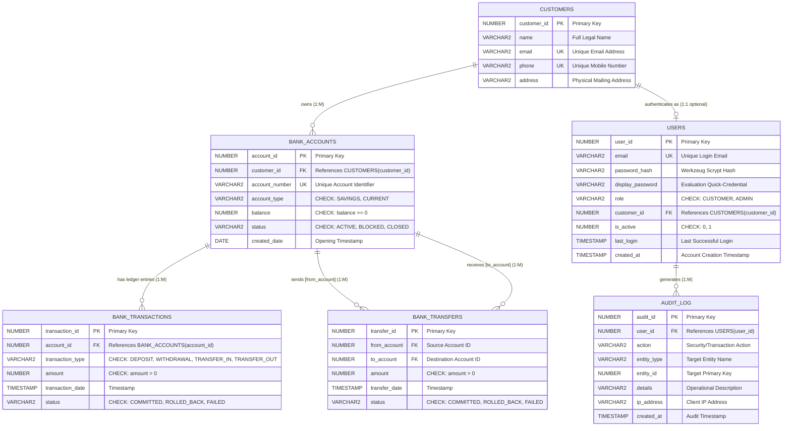

# KAPA Bank — Complete Project Documentation, ER Model, ER &rarr; Relational Mapping & DBMS Analysis

---

## Table of Contents
1. [Project Overview & Objectives](#1-project-overview--objectives)
2. [Complete Technology Stack Inventory](#2-complete-technology-stack-inventory)
3. [System Architecture & Request Lifecycle](#3-system-architecture--request-lifecycle)
4. [Complete System Functionality](#4-complete-system-functionality)
5. [Database Entities & Schema Specification](#5-database-entities--schema-specification)
6. [Conceptual Entity Classification](#6-conceptual-entity-classification)
7. [Conceptual ER Model](#7-conceptual-er-model)
8. [ER Diagram (Mermaid & Academic Notation)](#8-er-diagram-mermaid--academic-notation)
9. [Entity Attributes Classification](#9-entity-attributes-classification)
10. [Relationships & Participation Constraints](#10-relationships--participation-constraints)
11. [Special Case Analysis: Inter-Account Transfers](#11-special-case-analysis-inter-account-transfers)
12. [Transaction & Ledger Model](#12-transaction--ledger-model)
13. [Formal ER &rarr; Relational Model Mapping Rules](#13-formal-er--relational-model-mapping-rules)
14. [Complete Relational Schema & Table Definitions](#14-complete-relational-schema--table-definitions)
15. [Keys: Primary, Candidate, Alternate & Foreign Keys](#15-keys-primary-candidate-alternate--foreign-keys)
16. [Database Integrity Constraints](#16-database-integrity-constraints)
17. [Referential Integrity & Anomaly Prevention](#17-referential-integrity--anomaly-prevention)
18. [Functional Dependencies & Normalization (1NF, 2NF, 3NF, BCNF)](#18-functional-dependencies--normalization-1nf-2nf-3nf-bcnf)
19. [Database Transactions (COMMIT, ROLLBACK, SAVEPOINT)](#19-database-transactions-commit-rollback-savepoint)
20. [Concurrency Control & Row-Level Locking](#20-concurrency-control--row-level-locking)
21. [ACID Properties Implementation](#21-acid-properties-implementation)
22. [SQL & Relational DBMS Concepts Demonstrated](#22-sql--relational-dbms-concepts-demonstrated)
23. [Important SQL Queries in the Application](#23-important-sql-queries-in-the-application)
24. [Authentication, Authorization & RBAC Data Model](#24-authentication-authorization--rbac-data-model)
25. [Customer Data Isolation & Ownership Enforcement](#25-customer-data-isolation--ownership-enforcement)
26. [Administrative Access & System Governance](#26-administrative-access--system-governance)
27. [PDF Statements & Analytics Reporting Architecture](#27-pdf-statements--analytics-reporting-architecture)
28. [Application & Database Security Architecture](#28-application--database-security-architecture)
29. [Complete User Workflows](#29-complete-user-workflows)
30. [File Structure & Component Responsibilities](#30-file-structure--component-responsibilities)
31. [Complete Route Documentation](#31-complete-route-documentation)
32. [ER &rarr; Relational Full Mapping Summary Table](#32-er--relational-full-mapping-summary-table)
33. [Text Version of Conceptual ER Model](#33-text-version-of-conceptual-er-model)
34. [Text Version of Relational Model](#34-text-version-of-relational-model)
35. [Comprehensive Viva Voce Preparation (35+ Questions & Answers)](#35-comprehensive-viva-voce-preparation-35-questions--answers)
36. [Presentation Explanations (30-Sec, 1-Min, 3-Min)](#36-presentation-explanations-30-sec-1-min-3-min)
37. [Professor-Friendly Academic Summary](#37-professor-friendly-academic-summary)
38. [Design Observations, Limitations & Engineering Compromises](#38-design-observations-limitations--engineering-compromises)
39. [ER Model & Relational Model Consistency Verification](#39-er-model--relational-model-consistency-verification)
40. [Final Academic Submission Summary](#40-final-academic-submission-summary)

---

## 1. Project Overview & Objectives

### 1.1 Project Identification
- **Project Name:** KAPA Bank
- **Domain:** Bank Transaction Management System / Academic DBMS Application
- **Course Context:** Database Management Systems (DBMS) Laboratory Coursework & Viva Evaluation at Vellore Institute of Technology (VIT)
- **Database Engine:** Oracle Autonomous Database Serverless (Oracle Cloud Infrastructure, `kapabank_low` service tier)
- **Backend Framework:** Python 3.14 / Flask 3.1
- **Live Production Deployment:** [`https://kapa-dbms.vercel.app`](https://kapa-dbms.vercel.app)
- **Source Code Repository:** GitHub (`ash-sk06/KAPA-Bank`)

### 1.2 Problem Solved by KAPA Bank
In banking applications, maintaining ledger integrity, handling concurrent financial operations without race conditions, and enforcing strict data isolation between tenants are paramount. 

Many student DBMS projects limit themselves to basic CRUD operations without demonstrating actual database engine capabilities. **KAPA Bank** was engineered specifically to bridge theoretical database textbooks and realistic relational database implementations by demonstrating:
1. **Multi-Table Relational Schema Design:** Modeling normalized entities (`CUSTOMERS`, `BANK_ACCOUNTS`, `BANK_TRANSACTIONS`, `BANK_TRANSFERS`, `USERS`, `AUDIT_LOG`).
2. **ACID Transaction Demarcation:** Demonstrating strict Atomicity, Consistency, Isolation, and Durability during multi-step financial transfers.
3. **Interactive Transaction Control Language (TCL):** Providing an interactive sandbox to test and observe `COMMIT`, `ROLLBACK`, and `SAVEPOINT`.
4. **Pessimistic Concurrency Control:** Using canonical row-level locking (`SELECT ... FOR UPDATE`) with ordered resource locking to eliminate lost updates and prevent deadlocks.
5. **Multi-Tenant Security & RBAC:** Enforcing session-backed customer data isolation and role-based administrative governance.

> [!IMPORTANT]
> **Academic Simulation Scope:** KAPA Bank is an educational laboratory demonstration project designed for academic evaluation. It simulates banking workflows (deposits, withdrawals, transfers, account freezing, PDF statements) on a cloud database. It is **not** a real-world commercial banking institution.

---

## 2. Complete Technology Stack Inventory

| Component | Technology | Version | Architectural Role & Purpose |
|---|---|---|---|
| **Programming Language** | Python | 3.14.7 | Server-side execution, data parsing, and business logic orchestration. |
| **Web Framework** | Flask | 3.1.3 | WSGI routing, HTTP request handling, session lifecycle, and error handling. |
| **Database Engine** | Oracle Cloud Autonomous Database | 19c / 23ai | Managed relational DBMS providing ACID execution, identity sequences, and integrity constraints. |
| **Database Driver** | python-oracledb | 4.0.2 | Native thin driver connecting over TLS/TCPS port 1522 via encrypted Oracle Wallet credentials. |
| **Template Engine** | Jinja2 | 3.1.6 | Dynamic HTML rendering with server-side variable interpolation, security auto-escaping, and layout inheritance. |
| **PDF Generation** | fpdf2 | 2.8.8 | Generates downloadable binary bank statements (`application/pdf`) directly in memory. |
| **Password Security** | Werkzeug | 3.1.8 | One-way password hashing using `Scrypt` key derivation function with random salt. |
| **Frontend Styling** | Vanilla CSS3 | Custom System | Accessible, responsive banking UI conforming to WCAG 2.2 AA standards. |
| **Cloud Hosting** | Vercel Serverless | Python Runtime | Global edge deployment executing the WSGI application with Oracle Cloud TLS connectivity. |

---

## 3. System Architecture & Request Lifecycle

```text
+-------------------------------------------------------------------------------+
|                             CLIENT TIER (Browser)                             |
|  - HTML5 / Vanilla CSS3 / JavaScript (DOM, Modals, Password Toggles)          |
|  - Submits HTTPS Requests with CSRF Tokens                                    |
+---------------------------------------+---------------------------------------+
                                        |  (HTTPS / TLS Port 443)
                                        v
+-------------------------------------------------------------------------------+
|                       EDGE PROXY & ROUTING (Vercel)                           |
|  - Terminates TLS, handles static assets (/static, /public)                   |
|  - Forwards WSGI requests to Python serverless function                      |
+---------------------------------------+---------------------------------------+
                                        |
                                        v
+-------------------------------------------------------------------------------+
|                       FLASK APPLICATION SERVER (app.py)                       |
|  - Security: CSRF Validation, Session Cookie Verification, Werkzeug Hashing   |
|  - RBAC Middleware: @login_required, @customer_required, @admin_required       |
|  - Route Handlers & Input Validators (Decimal currency parsing)               |
|  - Document Generators: PDF statement builder (reports.py)                    |
+---------------------------------------+---------------------------------------+
                                        |
                                        v
+-------------------------------------------------------------------------------+
|                     DATABASE ACCESS LAYER (database.py)                       |
|  - python-oracledb Thin Driver with Oracle Cloud Wallet TLS Reconstruction     |
|  - Bind Parameter Query Execution (:1, :2)                                    |
|  - Tuple-to-Dictionary Conversion (dictfetchall, dictfetchone)                |
+---------------------------------------+---------------------------------------+
                                        |  (Encrypted TCPS over Port 1522)
                                        v
+-------------------------------------------------------------------------------+
|               RELATIONAL DATABASE TIER (Oracle Autonomous Database)            |
|  - Tables: CUSTOMERS, USERS, BANK_ACCOUNTS, BANK_TRANSACTIONS,                |
|            BANK_TRANSFERS, AUDIT_LOG                                          |
|  - Engine Features: Identity Sequences, Row Locks, Undo/Redo Logs, Views      |
|  - Integrity Constraints: PK, FK, UNIQUE, CHECK, NOT NULL                     |
+-------------------------------------------------------------------------------+
```

### 3.1 Detailed Request Lifecycle Step-by-Step
1. **Client Submission:** The user fills out a form (e.g., Fund Transfer) and submits an HTTP POST request. The request payload contains the form data along with a hidden cryptographic CSRF token.
2. **CSRF Verification:** `validate_csrf()` extracts the token and uses `secrets.compare_digest()` to compare it against `session['csrf_token']` in constant time, defeating Cross-Site Request Forgery attacks.
3. **Authentication & Authorization Decorator:**
   - `@customer_required`: Checks `session['user_id']` and `session['role'] == 'CUSTOMER'`.
   - Backend ownership check: Confirms `account.customer_id == session['customer_id']`, preventing Insecure Direct Object Reference (IDOR) attacks.
4. **Database Connection & Transaction Start:**
   - `database.get_connection()` checks out a connection to Oracle Autonomous Database using the auto-reconstructed TLS wallet.
   - A `SAVEPOINT` is marked (e.g., `SAVEPOINT before_transfer`).
5. **Pessimistic Concurrency Lock:**
   - Accounts are queried with `SELECT ... FOR UPDATE` ordered by `account_id` ascending to prevent deadlock cycles.
6. **Integrity & Business Logic Evaluation:**
   - Verifies accounts are `ACTIVE` and source account has `balance >= amount`.
7. **Database Mutations (DML):**
   - Updates source account balance (`balance = balance - amount`).
   - Updates destination account balance (`balance = balance + amount`).
   - Inserts record into `BANK_TRANSFERS`.
   - Inserts dual ledger records into `BANK_TRANSACTIONS` (`TRANSFER_OUT` and `TRANSFER_IN`).
   - Writes an immutable audit trail record into `AUDIT_LOG`.
8. **Commit & Release:**
   - `connection.commit()` flushes the redo log buffers, finalizes the transaction, and automatically releases all acquired row-level locks.
9. **Template Rendering:**
   - The response renders a feedback page (`render_success` or `render_error`) returning an accessible HTML5 page to the user.

---

## 4. Complete System Functionality

### 4.1 Unauthenticated & Public Operations
- **Public Root Redirection (`/`):** Redirects unauthenticated visitors to `/login`.
- **Academic Disclaimer Banner:** Prominently announces on all pages that the platform is an academic DBMS simulation for course evaluation.
- **Dynamic Evaluation Credentials Directory (`/credentials`):** Evaluators can review all active users, pre-assigned roles, and linked account numbers fetched dynamically from the database.
- **Login Modal (`/login`):** An interactive modal displaying all user accounts with their full names. Clicking any card autofills the email and password immediately.
- **Customer Self-Registration (`/register`):**
  - Allows new users to create a customer profile, establish a login, and open an initial zero-balance `SAVINGS` or `CURRENT` account.
  - Features interactive **Show / Hide Password** toggles for both "Password" and "Confirm Password" fields.

### 4.2 Customer Banking Portal (Self-Service)
- **Customer Dashboard (`/dashboard`):** Overview displaying the customer's total balance, active accounts, recent transactions, and quick action cards.
- **Customer Profile (`/profile`):** Displays the customer's legal name, email, registered telephone number, mailing address, and customer ID.
- **Portfolio & Accounts Overview (`/accounts`):** Lists all accounts owned by the logged-in customer. Includes the **Quick Transaction Action Grid** featuring side-by-side forms for:
  - **Instant Cash Deposit:** Credit funds into any active account owned by the user.
  - **Cash Withdrawal:** Debit funds from any active account with sufficient balance.
- **Account Ledger Details (`/accounts/<id>`):** Displays an account's details, lifetime credit/debit aggregates, and chronological transaction history.
- **Inter-Account Fund Transfer (`/transfer`):**
  - Enables transferring money from an owned active account to any active destination account.
  - Enforces atomic dual-entry ledger recording and prevents self-transfers.
- **Transaction History & Ledger (`/transactions`):** Filter transactions by type (`DEPOSIT`, `WITHDRAWAL`, `TRANSFER_IN`, `TRANSFER_OUT`) and status (`COMMITTED`, `ROLLED_BACK`).
- **Account Statements (`/statements`):** Select an account and date range to view statement summaries.
- **Statement Downloads:**
  - **PDF Export (`/statements/pdf/<id>`):** Streams an official, vector-styled bank statement PDF generated on the fly.
  - **CSV Export (`/statements/csv/<id>`):** Downloads raw transaction ledger entries formatted as a spreadsheet-ready CSV.

### 4.3 Administrative Operations Console (Staff & Operations)
- **Admin Dashboard (`/admin`):** Displays real-time aggregate statistics (total system customers, total active accounts, cumulative bank vault balance, total transaction volume, recent audit events).
- **Customer Management (`/admin/customers`):** Lists all customers with search capabilities and account counts.
- **Customer Creation (`POST /admin/add-customer`):** Administrative provisioning of a customer profile.
- **Customer Detail View (`/admin/customers/<id>`):** Deep-dive into a customer's linked accounts, login identity, and transaction activity.
- **Account Provisioning (`POST /admin/add-account`):** Administrators can provision additional accounts for existing customers.
- **Account Lifecycle & Freezing (`POST /admin/accounts/<id>/toggle-status`):**
  - Administrators can toggle account status between `ACTIVE` and `BLOCKED`.
  - Blocked accounts are immediately rejected by database CHECK constraints and backend guards from processing deposits, withdrawals, or transfers.
- **Global Transaction Ledger (`/admin/transactions`):** Unfiltered inspection of all transactions across all accounts in the bank.
- **Security Audit Trail (`/admin/audit-log`):** Immutable log of logins, account status toggles, transfers, and administrative actions with IP addresses and timestamps.
- **SQL Analytics & Aggregates (`/admin/reports`):** Statistical reports powered by SQL queries (`GROUP BY`, `SUM`, `COUNT`, `AVG`, `CASE`).
- **Interactive TCL Demonstration Sandbox (`/transaction-control`):**
  - Dedicated interactive laboratory sandbox using the designated demo account (`DEMO1001` / Customer ID 21).
  - Evaluators can trigger live database operations:
    - **COMMIT Demo:** Debits/credits and commits changes permanently.
    - **ROLLBACK Demo:** Modifies balance in an uncommitted transaction and rolls it back, proving atomicity and data preservation.
    - **SAVEPOINT Demo:** Applies a partial update, sets a `SAVEPOINT`, executes a second update, rolls back to the savepoint, and commits only the first update.
    - **Reset Sandbox:** Restores the demo account balance to exactly ₹10,000.00.

---

## 5. Database Entities & Schema Specification

The final implementation contains **6 physical database tables** and **2 relational views** in Oracle Autonomous Database:

### Table 1: `CUSTOMERS`
- **Purpose:** Stores legal identity and contact records of bank patrons.
- **Attributes:**
  - `customer_id` (`NUMBER`, Identity PK, `NOT NULL`)
  - `name` (`VARCHAR2(100)`, `NOT NULL`)
  - `email` (`VARCHAR2(100)`, `NOT NULL`, `UNIQUE`)
  - `phone` (`VARCHAR2(15)`, `NOT NULL`, `UNIQUE`)
  - `address` (`VARCHAR2(200)`, `NULLABLE`)
- **Primary Key:** `customer_id`
- **Candidate / Alternate Keys:** `email`, `phone`
- **Integrity Constraints:**
  - `pk_customers`: `PRIMARY KEY (customer_id)`
  - `uq_customer_email`: `UNIQUE (email)`
  - `uq_customer_phone`: `UNIQUE (phone)`

### Table 2: `USERS`
- **Purpose:** Manages authentication credentials, role assignments, and login tracking.
- **Attributes:**
  - `user_id` (`NUMBER`, Identity PK, `NOT NULL`)
  - `email` (`VARCHAR2(100)`, `NOT NULL`, `UNIQUE`)
  - `password_hash` (`VARCHAR2(255)`, `NOT NULL`)
  - `display_password` (`VARCHAR2(100)`, `NULLABLE`) — maintained for academic evaluation
  - `role` (`VARCHAR2(20)`, `DEFAULT 'CUSTOMER'`, `NOT NULL`)
  - `customer_id` (`NUMBER`, `NULLABLE`, FK &rarr; `CUSTOMERS.customer_id`)
  - `is_active` (`NUMBER(1)`, `DEFAULT 1`, `NOT NULL`)
  - `last_login` (`TIMESTAMP`, `NULLABLE`)
  - `created_at` (`TIMESTAMP`, `DEFAULT SYSTIMESTAMP`, `NOT NULL`)
- **Primary Key:** `user_id`
- **Candidate Key:** `email`
- **Foreign Key:** `customer_id` references `CUSTOMERS(customer_id) ON DELETE CASCADE`
- **CHECK Constraints:**
  - `chk_user_role`: `role IN ('CUSTOMER', 'ADMIN')`
  - `chk_user_active`: `is_active IN (0, 1)`

### Table 3: `BANK_ACCOUNTS`
- **Purpose:** Represents individual financial accounts holding monetary balances.
- **Attributes:**
  - `account_id` (`NUMBER`, Identity PK, `NOT NULL`)
  - `customer_id` (`NUMBER`, `NOT NULL`, FK &rarr; `CUSTOMERS.customer_id`)
  - `account_number` (`VARCHAR2(20)`, `NOT NULL`, `UNIQUE`)
  - `account_type` (`VARCHAR2(20)`, `NOT NULL`)
  - `balance` (`NUMBER(15,2)`, `DEFAULT 0`, `NOT NULL`)
  - `status` (`VARCHAR2(20)`, `DEFAULT 'ACTIVE'`, `NOT NULL`)
  - `created_date` (`DATE`, `DEFAULT SYSDATE`, `NOT NULL`)
- **Primary Key:** `account_id`
- **Candidate Key:** `account_number`
- **Foreign Key:** `customer_id` references `CUSTOMERS(customer_id)`
- **CHECK Constraints:**
  - `chk_account_type`: `account_type IN ('SAVINGS', 'CURRENT')`
  - `chk_account_balance`: `balance >= 0` (Prevents overdraft at database level)
  - `chk_account_status`: `status IN ('ACTIVE', 'BLOCKED', 'CLOSED')`

### Table 4: `BANK_TRANSACTIONS`
- **Purpose:** Immutable double-entry financial ledger recording every balance change.
- **Attributes:**
  - `transaction_id` (`NUMBER`, Identity PK, `NOT NULL`)
  - `account_id` (`NUMBER`, `NOT NULL`, FK &rarr; `BANK_ACCOUNTS.account_id`)
  - `transaction_type` (`VARCHAR2(20)`, `NOT NULL`)
  - `amount` (`NUMBER(15,2)`, `NOT NULL`)
  - `transaction_date` (`TIMESTAMP`, `DEFAULT SYSTIMESTAMP`, `NOT NULL`)
  - `status` (`VARCHAR2(20)`, `DEFAULT 'COMMITTED'`, `NOT NULL`)
- **Primary Key:** `transaction_id`
- **Foreign Key:** `account_id` references `BANK_ACCOUNTS(account_id)`
- **CHECK Constraints:**
  - `chk_transaction_type`: `transaction_type IN ('DEPOSIT', 'WITHDRAWAL', 'TRANSFER_IN', 'TRANSFER_OUT')`
  - `chk_transaction_amount`: `amount > 0`
  - `chk_transaction_status`: `status IN ('COMMITTED', 'ROLLED_BACK', 'FAILED')`

### Table 5: `BANK_TRANSFERS`
- **Purpose:** Higher-level transaction entity capturing inter-account fund movements between two accounts.
- **Attributes:**
  - `transfer_id` (`NUMBER`, Identity PK, `NOT NULL`)
  - `from_account` (`NUMBER`, `NOT NULL`, FK &rarr; `BANK_ACCOUNTS.account_id`)
  - `to_account` (`NUMBER`, `NOT NULL`, FK &rarr; `BANK_ACCOUNTS.account_id`)
  - `amount` (`NUMBER(15,2)`, `NOT NULL`)
  - `transfer_date` (`TIMESTAMP`, `DEFAULT SYSTIMESTAMP`, `NOT NULL`)
  - `status` (`VARCHAR2(20)`, `DEFAULT 'COMMITTED'`, `NOT NULL`)
- **Primary Key:** `transfer_id`
- **Foreign Keys:**
  - `from_account` references `BANK_ACCOUNTS(account_id)`
  - `to_account` references `BANK_ACCOUNTS(account_id)`
- **CHECK Constraints:**
  - `chk_transfer_amount`: `amount > 0`
  - `chk_transfer_status`: `status IN ('COMMITTED', 'ROLLED_BACK', 'FAILED')`
  - `chk_different_accounts`: `from_account <> to_account` (Eliminates self-transfer)

### Table 6: `AUDIT_LOG`
- **Purpose:** Immutable compliance and security audit log recording system actions.
- **Attributes:**
  - `audit_id` (`NUMBER`, Identity PK, `NOT NULL`)
  - `user_id` (`NUMBER`, `NULLABLE`, FK &rarr; `USERS.user_id`)
  - `action` (`VARCHAR2(50)`, `NOT NULL`)
  - `entity_type` (`VARCHAR2(50)`, `NULLABLE`)
  - `entity_id` (`NUMBER`, `NULLABLE`)
  - `details` (`VARCHAR2(500)`, `NULLABLE`)
  - `ip_address` (`VARCHAR2(45)`, `NULLABLE`)
  - `created_at` (`TIMESTAMP`, `DEFAULT SYSTIMESTAMP`, `NOT NULL`)
- **Primary Key:** `audit_id`
- **Foreign Key:** `user_id` references `USERS(user_id) ON DELETE SET NULL`

---

## 6. Conceptual Entity Classification

In database theory, entities are classified based on their existential dependency and role:

1. **Strong Entities (Regular Entities):**
   - **`CUSTOMER`:** Has independent existence with its own primary key (`customer_id`). It does not rely on any other entity to exist.
   - **`BANK_ACCOUNT`:** Modeled as a strong entity in this relational implementation because it carries its own generated primary key (`account_id`) and natural alternate key (`account_number`), though it participates in an existential relationship with `CUSTOMER`.
   - **`USER`:** Independent authentication entity with primary key (`user_id`) and natural unique key (`email`). Administrators exist as `USERS` without any associated `CUSTOMER` record.

2. **Associative / Relationship Entities:**
   - **`TRANSFER` (`BANK_TRANSFERS`):** Represents an inter-entity relationship between two accounts (Source Account and Destination Account). It stores relationship-specific attributes (`amount`, `transfer_date`, `status`). Because it has its own identity key (`transfer_id`), it is formally an **associative entity**.

3. **Subordinate / Ledger Entities:**
   - **`TRANSACTION` (`BANK_TRANSACTIONS`):** Represents single-account ledger adjustments. Dependent on `BANK_ACCOUNT`.
   - **`AUDIT_ENTRY` (`AUDIT_LOG`):** Represents chronological events triggered by system actors.

---

## 7. Conceptual ER Model

### Entities, Attributes & Cardinalities

```text
+-------------------+              1 : M              +-------------------+
|     CUSTOMER      | ------------------------------< |   BANK_ACCOUNT    |
+-------------------+                                 +-------------------+
        |                                                       |
        | 1 : (0..1)                                            | 1 : M
        |                                                       v
+-------------------+                             +---------------------------+
|       USER        |                             |     BANK_TRANSACTION      |
+-------------------+                             +---------------------------+
        |                                                       ^
        | 1 : M                                                 | (Source / Dest)
        v                                                       |
+-------------------+                             +---------------------------+
|     AUDIT_LOG     |                             |       BANK_TRANSFER       |
+-------------------+                             +---------------------------+
```

### Relationship Cardinalities & Participation:

1. **`CUSTOMER` owns `BANK_ACCOUNT`**
   - **Cardinality:** `1 : M` (One customer may own zero, one, or multiple bank accounts; each bank account belongs to exactly one customer).
   - **Participation:** `CUSTOMER` is Partial (a newly registered customer may initially have no accounts, or may have accounts closed); `BANK_ACCOUNT` is Total (`customer_id` is `NOT NULL`).

2. **`BANK_ACCOUNT` has `BANK_TRANSACTION`**
   - **Cardinality:** `1 : M` (One account has zero or many transactions; each transaction belongs to exactly one account).
   - **Participation:** `BANK_ACCOUNT` is Partial; `BANK_TRANSACTION` is Total (`account_id` is `NOT NULL`).

3. **`BANK_ACCOUNT` sends `BANK_TRANSFER` (Role: Source Account)**
   - **Cardinality:** `1 : M` (One account can initiate zero or many transfers; each transfer has exactly one source account).
   - **Participation:** `BANK_ACCOUNT` is Partial; `BANK_TRANSFERS` is Total (`from_account` is `NOT NULL`).

4. **`BANK_ACCOUNT` receives `BANK_TRANSFER` (Role: Destination Account)**
   - **Cardinality:** `1 : M` (One account can receive zero or many transfers; each transfer has exactly one destination account).
   - **Participation:** `BANK_ACCOUNT` is Partial; `BANK_TRANSFERS` is Total (`to_account` is `NOT NULL`).

5. **`USER` authenticates as `CUSTOMER`**
   - **Cardinality:** `1 : (0..1)` (Each user may be associated with at most one customer; an administrator has no customer record).
   - **Participation:** `USER` is Partial (`customer_id` is `NULLABLE`); `CUSTOMER` is Partial (a customer record can exist prior to user portal registration).

6. **`USER` triggers `AUDIT_LOG`**
   - **Cardinality:** `1 : M` (One user triggers zero or many audit log entries; an audit entry may have a NULL user_id if triggered by an anonymous system event).
   - **Participation:** `USER` is Partial; `AUDIT_LOG` is Partial (`user_id` is `NULLABLE`).

---

## 8. ER Diagram (Mermaid & Academic Notation)



---

## 9. Entity Attributes Classification

In conceptual database design, attributes are characterized into standard categories:

| Entity | Attribute | Simple / Composite | Single / Multi-Valued | Stored / Derived | Key Classification |
|---|---|---|---|---|---|
| **CUSTOMER** | `customer_id` | Simple | Single-valued | Stored | **Primary Key** |
| | `name` | Simple | Single-valued | Stored | Non-key |
| | `email` | Simple | Single-valued | Stored | **Candidate / Alternate Key** |
| | `phone` | Simple | Single-valued | Stored | **Candidate / Alternate Key** |
| | `address` | Simple | Single-valued | Stored | Non-key (Optional) |
| **USER** | `user_id` | Simple | Single-valued | Stored | **Primary Key** |
| | `email` | Simple | Single-valued | Stored | **Candidate / Alternate Key** |
| | `password_hash`| Simple | Single-valued | Stored | Non-key |
| | `role` | Simple | Single-valued | Stored | Non-key (Domain restricted) |
| | `customer_id` | Simple | Single-valued | Stored | **Foreign Key** |
| **BANK_ACCOUNT** | `account_id` | Simple | Single-valued | Stored | **Primary Key** |
| | `account_number` | Simple | Single-valued | Stored | **Candidate / Alternate Key** |
| | `balance` | Simple | Single-valued | **Stored** (Updated on txns) | Non-key |
| | `account_type`| Simple | Single-valued | Stored | Non-key |
| | `status` | Simple | Single-valued | Stored | Non-key |
| **BANK_TRANSACTIONS** | `transaction_id`| Simple | Single-valued | Stored | **Primary Key** |
| | `amount` | Simple | Single-valued | Stored | Non-key |
| | `transaction_type`| Simple | Single-valued | Stored | Non-key |
| | `status` | Simple | Single-valued | Stored | Non-key |
| **BANK_TRANSFERS** | `transfer_id` | Simple | Single-valued | Stored | **Primary Key** |
| | `amount` | Simple | Single-valued | Stored | Non-key |
| | `from_account`| Simple | Single-valued | Stored | **Foreign Key** (Source Role) |
| | `to_account` | Simple | Single-valued | Stored | **Foreign Key** (Destination Role) |

---

## 10. Relationships & Participation Constraints

| Relationship Name | Entity 1 | Entity 2 | Cardinality | Entity 1 Participation | Entity 2 Participation | Meaning & Integrity Purpose |
|---|---|---|---|---|---|---|
| **OWNS** | `CUSTOMER` | `BANK_ACCOUNT` | `1 : M` | Partial (0..N) | Total (1..1) | A customer owns zero, one, or many bank accounts. Every account must belong to a valid customer. |
| **AUTHENTICATES_AS**| `CUSTOMER` | `USER` | `1 : 1` (opt) | Partial (0..1) | Partial (0..1) | Links web authentication identity to legal customer identity. Admins have no customer record. |
| **HAS_LEDGER** | `BANK_ACCOUNT` | `BANK_TRANSACTIONS`| `1 : M` | Partial (0..N) | Total (1..1) | An account accumulates individual debits/credits. Every ledger entry must reference an account. |
| **SENDS_TRANSFER** | `BANK_ACCOUNT` | `BANK_TRANSFERS` | `1 : M` | Partial (0..N) | Total (1..1) | An account initiates outgoing transfers as the debited source (`from_account`). |
| **RECEIVES_TRANSFER**| `BANK_ACCOUNT` | `BANK_TRANSFERS` | `1 : M` | Partial (0..N) | Total (1..1) | An account receives incoming transfers as the credited target (`to_account`). |
| **TRIGGERS_AUDIT** | `USER` | `AUDIT_LOG` | `1 : M` | Partial (0..N) | Partial (0..1) | An authenticated user generates audit logs during sensitive banking activities. |

---

## 11. Special Case Analysis: Inter-Account Transfers

### 11.1 The Dual-Role Relationship Problem
In database design, when an entity is related to itself through an associative relationship, it is termed a **recursive (or unary) relationship**. In KAPA Bank, an inter-account transfer is fundamentally an interaction between **two instances of the same entity type (`BANK_ACCOUNT`)**.

```text
                +-------------------+
                |   BANK_ACCOUNT    |
                +-------------------+
                   |             |
       (Role: Source)      (Role: Destination)
                   |             |
                   v             v
                +-------------------+
                |   BANK_TRANSFERS  |
                +-------------------+
```

### 11.2 Role Names
To avoid ambiguity in the relational schema:
- **Role 1: Source / Debited Account (`from_account`):** The account from which funds are deducted.
- **Role 2: Destination / Credited Account (`to_account`):** The account into which funds are added.

### 11.3 Why `BANK_TRANSFERS` is Formally an Associative Entity
`BANK_TRANSFERS` is not merely a foreign key relationship; it carries its own distinct attributes:
- `amount`: Monetary value transferred.
- `transfer_date`: Exact timestamp of execution.
- `status`: Transactional outcome (`COMMITTED`, `ROLLED_BACK`, `FAILED`).
- `chk_different_accounts`: CHECK constraint enforcing `from_account <> to_account`.

---

## 12. Transaction & Ledger Model

### 12.1 Distinction Between `TRANSFER` and `TRANSACTION`
Students often ask in viva: *"Why does the database store both `BANK_TRANSFERS` and `BANK_TRANSACTIONS`?"*

1. **`BANK_TRANSFERS` (The Relational Agreement):**
   - Captures the **binary relationship** between two separate accounts.
   - Answers: *"Which account sent money to which account, when, and under what reference?"*
2. **`BANK_TRANSACTIONS` (The Individual Account Ledger):**
   - Captures the **single-account point of view** required for customer bank statements.
   - Answers: *"How did Account X's balance change on Date D?"*
   - When Account A transfers ₹1,000 to Account B:
     - Record 1 in `BANK_TRANSACTIONS`: `account_id = A`, `type = 'TRANSFER_OUT'`, `amount = 1000`
     - Record 2 in `BANK_TRANSACTIONS`: `account_id = B`, `type = 'TRANSFER_IN'`, `amount = 1000`
     - Record 3 in `BANK_TRANSFERS`: `from_account = A`, `to_account = B`, `amount = 1000`

This dual-recording structure satisfies **Double-Entry Bookkeeping Principles** and allows $O(1)$ statement generation for an individual account without performing expensive cross-table joins.

---

## 13. Formal ER &rarr; Relational Model Mapping Rules

The conceptual ER model is converted to relational tables using formal 7-step mapping algorithms:

### Step 1: Mapping Regular (Strong) Entity Types
- For each strong entity $E$, create a relation $R$ including all simple attributes.
- **`CUSTOMER` &rarr; `CUSTOMERS`** with PK `customer_id`.
- **`USER` &rarr; `USERS`** with PK `user_id`.
- **`BANK_ACCOUNT` &rarr; `BANK_ACCOUNTS`** with PK `account_id`.

### Step 2: Mapping 1:1 Relationships
- For the `1:1` relationship `USER authenticates as CUSTOMER`:
- Include the primary key of `CUSTOMER` (`customer_id`) as a foreign key in `USERS`.
- Since an administrator is a `USER` without a `CUSTOMER`, `customer_id` is set to `NULLABLE`.

### Step 3: Mapping 1:M Binary Relationships
- For each binary $1:M$ relationship, the primary key of the entity on the "1" side becomes a foreign key in the relation on the "M" side:
- **`CUSTOMER owns BANK_ACCOUNT` (1:M):** `customer_id` is placed into `BANK_ACCOUNTS`.
- **`BANK_ACCOUNT has BANK_TRANSACTION` (1:M):** `account_id` is placed into `BANK_TRANSACTIONS`.
- **`USER triggers AUDIT_LOG` (1:M):** `user_id` is placed into `AUDIT_LOG`.

### Step 4: Mapping Recursive / M:N Associative Relationships
- The transfer relationship connects `BANK_ACCOUNT` to `BANK_ACCOUNT` with relationship attributes (`amount`, `transfer_date`, `status`).
- Map this into a distinct relation **`BANK_TRANSFERS`** containing:
  - Surrogate PK `transfer_id`
  - FK `from_account` referencing `BANK_ACCOUNTS(account_id)`
  - FK `to_account` referencing `BANK_ACCOUNTS(account_id)`
  - Relationship attributes: `amount`, `transfer_date`, `status`

---

## 14. Complete Relational Schema & Table Definitions

```sql
-- 1. CUSTOMERS
CREATE TABLE customers (
    customer_id NUMBER GENERATED BY DEFAULT AS IDENTITY,
    name VARCHAR2(100) NOT NULL,
    email VARCHAR2(100) NOT NULL,
    phone VARCHAR2(15) NOT NULL,
    address VARCHAR2(200),
    CONSTRAINT pk_customers PRIMARY KEY (customer_id),
    CONSTRAINT uq_customer_email UNIQUE (email),
    CONSTRAINT uq_customer_phone UNIQUE (phone)
);

-- 2. USERS
CREATE TABLE users (
    user_id NUMBER GENERATED BY DEFAULT AS IDENTITY,
    email VARCHAR2(100) NOT NULL,
    password_hash VARCHAR2(255) NOT NULL,
    display_password VARCHAR2(100),
    role VARCHAR2(20) DEFAULT 'CUSTOMER' NOT NULL,
    customer_id NUMBER,
    is_active NUMBER(1) DEFAULT 1 NOT NULL,
    last_login TIMESTAMP,
    created_at TIMESTAMP DEFAULT SYSTIMESTAMP NOT NULL,
    CONSTRAINT pk_users PRIMARY KEY (user_id),
    CONSTRAINT uq_user_email UNIQUE (email),
    CONSTRAINT fk_user_customer FOREIGN KEY (customer_id) 
        REFERENCES customers(customer_id) ON DELETE CASCADE,
    CONSTRAINT chk_user_role CHECK (role IN ('CUSTOMER', 'ADMIN')),
    CONSTRAINT chk_user_active CHECK (is_active IN (0, 1))
);

-- 3. BANK_ACCOUNTS
CREATE TABLE bank_accounts (
    account_id NUMBER GENERATED BY DEFAULT AS IDENTITY,
    customer_id NUMBER NOT NULL,
    account_number VARCHAR2(20) NOT NULL,
    account_type VARCHAR2(20) NOT NULL,
    balance NUMBER(15,2) DEFAULT 0 NOT NULL,
    status VARCHAR2(20) DEFAULT 'ACTIVE' NOT NULL,
    created_date DATE DEFAULT SYSDATE NOT NULL,
    CONSTRAINT pk_bank_accounts PRIMARY KEY (account_id),
    CONSTRAINT fk_account_customer FOREIGN KEY (customer_id)
        REFERENCES customers(customer_id),
    CONSTRAINT uq_account_number UNIQUE (account_number),
    CONSTRAINT chk_account_type CHECK (account_type IN ('SAVINGS', 'CURRENT')),
    CONSTRAINT chk_account_balance CHECK (balance >= 0),
    CONSTRAINT chk_account_status CHECK (status IN ('ACTIVE', 'BLOCKED', 'CLOSED'))
);

-- 4. BANK_TRANSACTIONS
CREATE TABLE bank_transactions (
    transaction_id NUMBER GENERATED BY DEFAULT AS IDENTITY,
    account_id NUMBER NOT NULL,
    transaction_type VARCHAR2(20) NOT NULL,
    amount NUMBER(15,2) NOT NULL,
    transaction_date TIMESTAMP DEFAULT SYSTIMESTAMP NOT NULL,
    status VARCHAR2(20) DEFAULT 'COMMITTED' NOT NULL,
    CONSTRAINT pk_bank_transactions PRIMARY KEY (transaction_id),
    CONSTRAINT fk_transaction_account FOREIGN KEY (account_id)
        REFERENCES bank_accounts(account_id),
    CONSTRAINT chk_transaction_type CHECK (
        transaction_type IN ('DEPOSIT', 'WITHDRAWAL', 'TRANSFER_IN', 'TRANSFER_OUT')
    ),
    CONSTRAINT chk_transaction_amount CHECK (amount > 0),
    CONSTRAINT chk_transaction_status CHECK (
        status IN ('COMMITTED', 'ROLLED_BACK', 'FAILED')
    )
);

-- 5. BANK_TRANSFERS
CREATE TABLE bank_transfers (
    transfer_id NUMBER GENERATED BY DEFAULT AS IDENTITY,
    from_account NUMBER NOT NULL,
    to_account NUMBER NOT NULL,
    amount NUMBER(15,2) NOT NULL,
    transfer_date TIMESTAMP DEFAULT SYSTIMESTAMP NOT NULL,
    status VARCHAR2(20) DEFAULT 'COMMITTED' NOT NULL,
    CONSTRAINT pk_bank_transfers PRIMARY KEY (transfer_id),
    CONSTRAINT fk_transfer_from FOREIGN KEY (from_account)
        REFERENCES bank_accounts(account_id),
    CONSTRAINT fk_transfer_to FOREIGN KEY (to_account)
        REFERENCES bank_accounts(account_id),
    CONSTRAINT chk_transfer_amount CHECK (amount > 0),
    CONSTRAINT chk_transfer_status CHECK (
        status IN ('COMMITTED', 'ROLLED_BACK', 'FAILED')
    ),
    CONSTRAINT chk_different_accounts CHECK (from_account <> to_account)
);

-- 6. AUDIT_LOG
CREATE TABLE audit_log (
    audit_id NUMBER GENERATED BY DEFAULT AS IDENTITY,
    user_id NUMBER,
    action VARCHAR2(50) NOT NULL,
    entity_type VARCHAR2(50),
    entity_id NUMBER,
    details VARCHAR2(500),
    ip_address VARCHAR2(45),
    created_at TIMESTAMP DEFAULT SYSTIMESTAMP NOT NULL,
    CONSTRAINT pk_audit_log PRIMARY KEY (audit_id),
    CONSTRAINT fk_audit_user FOREIGN KEY (user_id) 
        REFERENCES users(user_id) ON DELETE SET NULL
);
```

---

## 15. Keys: Primary, Candidate, Alternate & Foreign Keys

### 15.1 Definitions & Academic Distinction
- **Superkey:** Any set of attributes that uniquely identifies a tuple.
- **Candidate Key:** A minimal superkey (no proper subset is a superkey).
- **Primary Key:** The candidate key chosen by the database architect as the principal tuple identifier.
- **Alternate Key:** Any candidate key not chosen as the primary key.
- **Surrogate Key:** An artificially generated numeric identifier with no intrinsic business meaning (e.g., identity columns).

### 15.2 Key Audit by Relation

| Relation | Primary Key (PK) | Candidate Keys | Alternate Keys | Foreign Keys (FK) |
|---|---|---|---|---|
| **CUSTOMERS** | `customer_id` | `{customer_id}`, `{email}`, `{phone}` | `email`, `phone` | None |
| **USERS** | `user_id` | `{user_id}`, `{email}` | `email` | `customer_id` &rarr; `CUSTOMERS` |
| **BANK_ACCOUNTS** | `account_id` | `{account_id}`, `{account_number}` | `account_number` | `customer_id` &rarr; `CUSTOMERS` |
| **BANK_TRANSACTIONS**| `transaction_id` | `{transaction_id}` | None | `account_id` &rarr; `BANK_ACCOUNTS` |
| **BANK_TRANSFERS** | `transfer_id` | `{transfer_id}` | None | `from_account`, `to_account` &rarr; `BANK_ACCOUNTS` |
| **AUDIT_LOG** | `audit_id` | `{audit_id}` | None | `user_id` &rarr; `USERS` |

---

## 16. Database Integrity Constraints

Integrity constraints guard the database against corrupt or invalid states:

### 1. Domain Constraints (Data Types & Sizes)
- All attributes possess explicit domains (`NUMBER(15,2)`, `VARCHAR2(100)`, `TIMESTAMP`, etc.).

### 2. Entity Integrity Constraints (`PRIMARY KEY`, `NOT NULL`)
- No primary key attribute may evaluate to `NULL`. Guaranteed via Oracle identity columns and explicit `NOT NULL` declarations.

### 3. Key Constraints (`UNIQUE`)
- Prevents duplication across natural candidate keys:
  - `uq_customer_email`: Ensures unique customer email.
  - `uq_customer_phone`: Ensures unique phone number.
  - `uq_account_number`: Ensures unique bank account number.
  - `uq_user_email`: Ensures unique login username.

### 4. CHECK Constraints (Business Invariants)
- `chk_account_balance`: `balance >= 0` &mdash; **Prevents account overdrafts** at the physical storage layer.
- `chk_account_type`: `account_type IN ('SAVINGS', 'CURRENT')` &mdash; Restricts allowed account types.
- `chk_account_status`: `status IN ('ACTIVE', 'BLOCKED', 'CLOSED')` &mdash; Prevents illegal account states.
- `chk_transaction_type`: `transaction_type IN ('DEPOSIT', 'WITHDRAWAL', 'TRANSFER_IN', 'TRANSFER_OUT')`.
- `chk_transaction_amount`: `amount > 0` &mdash; Prohibits zero or negative transactions.
- `chk_transfer_amount`: `amount > 0`.
- `chk_different_accounts`: `from_account <> to_account` &mdash; Disallows self-transfers.
- `chk_user_role`: `role IN ('CUSTOMER', 'ADMIN')`.
- `chk_user_active`: `is_active IN (0, 1)`.

---

## 17. Referential Integrity & Anomaly Prevention

Referential integrity guarantees that foreign key references always point to existing, valid parent rows:

1. **Orphan Account Prevention:**
   - `BANK_ACCOUNTS.customer_id REFERENCES CUSTOMERS(customer_id)`.
   - An account cannot be opened without referencing an existing, registered customer.
2. **Orphan Ledger Entry Prevention:**
   - `BANK_TRANSACTIONS.account_id REFERENCES BANK_ACCOUNTS(account_id)`.
   - A transaction cannot be created in isolation; it must belong to a valid bank account.
3. **Valid Counterparty Enforcement in Transfers:**
   - `from_account` and `to_account` both reference `BANK_ACCOUNTS(account_id)`.
   - Money cannot be moved to or from non-existent accounts.
4. **ON DELETE Behaviors:**
   - `USERS.customer_id REFERENCES CUSTOMERS(customer_id) ON DELETE CASCADE`: Deleting a customer record purges their web login credentials.
   - `AUDIT_LOG.user_id REFERENCES USERS(user_id) ON DELETE SET NULL`: If a user account is removed, the audit log entries remain preserved with `user_id = NULL` for security compliance.

---

## 18. Functional Dependencies & Normalization (1NF, 2NF, 3NF, BCNF)

### 18.1 Functional Dependency Analysis

#### 1. Relation: `CUSTOMERS`
- **Candidate Keys:** `{customer_id}`, `{email}`, `{phone}`
- **Functional Dependencies:**
  - $FD_1: \text{customer\_id} \rightarrow \{\text{name, email, phone, address}\}$
  - $FD_2: \text{email} \rightarrow \{\text{customer\_id, name, phone, address}\}$
  - $FD_3: \text{phone} \rightarrow \{\text{customer\_id, name, email, address}\}$

#### 2. Relation: `BANK_ACCOUNTS`
- **Candidate Keys:** `{account_id}`, `{account_number}`
- **Functional Dependencies:**
  - $FD_1: \text{account\_id} \rightarrow \{\text{customer\_id, account\_number, account\_type, balance, status, created\_date}\}$
  - $FD_2: \text{account\_number} \rightarrow \{\text{account\_id, customer\_id, account\_type, balance, status, created\_date}\}$

#### 3. Relation: `BANK_TRANSACTIONS`
- **Candidate Key:** `{transaction_id}`
- **Functional Dependencies:**
  - $FD_1: \text{transaction\_id} \rightarrow \{\text{account\_id, transaction\_type, amount, transaction\_date, status}\}$

#### 4. Relation: `BANK_TRANSFERS`
- **Candidate Key:** `{transfer_id}`
- **Functional Dependencies:**
  - $FD_1: \text{transfer\_id} \rightarrow \{\text{from\_account, to\_account, amount, transfer\_date, status}\}$

#### 5. Relation: `USERS`
- **Candidate Keys:** `{user_id}`, `{email}`
- **Functional Dependencies:**
  - $FD_1: \text{user\_id} \rightarrow \{\text{email, password\_hash, display\_password, role, customer\_id, is\_active, last\_login, created\_at}\}$
  - $FD_2: \text{email} \rightarrow \{\text{user\_id, password\_hash, display\_password, role, customer\_id, is\_active, last\_login, created\_at}\}$

---

### 18.2 Normal Form Evaluations

#### First Normal Form (1NF)
- **Requirement:** All attributes must contain atomic (indivisible) values; no repeating groups or arrays.
- **Verification:** Every column stores a single scalar value (`VARCHAR2`, `NUMBER`, `TIMESTAMP`). No multi-valued composite columns exist.
- **Status:** Satisfies **1NF**.

#### Second Normal Form (2NF)
- **Requirement:** Must be in 1NF and contain **no partial dependencies** (no non-prime attribute may depend on a proper subset of any candidate key).
- **Verification:** All candidate keys across all tables are **single-attribute keys** (`customer_id`, `account_id`, `user_id`, `transfer_id`, `transaction_id`). Since no candidate key is composite, partial functional dependencies are mathematically impossible.
- **Status:** Satisfies **2NF**.

#### Third Normal Form (3NF)
- **Requirement:** Must be in 2NF and contain **no transitive dependencies** for non-prime attributes ($X \rightarrow Y \rightarrow Z$ where $Z$ is non-prime and $Y$ is not a superkey).
- **Verification:**
  - In `CUSTOMERS`, `name` and `address` depend directly on candidate keys (`customer_id`, `email`, `phone`).
  - In `BANK_ACCOUNTS`, `customer_id` is a foreign key. The account table does not redundantly duplicate customer attributes (`name`, `email`).
  - In `USERS`, `customer_id` is a foreign key without duplicating customer metadata.
  - In all FDs $X \rightarrow Y$, the determinant $X$ is a superkey.
- **Status:** Satisfies **3NF**.

#### Boyce-Codd Normal Form (BCNF)
- **Requirement:** For every non-trivial functional dependency $X \rightarrow Y$, $X$ must be a **superkey**.
- **Verification:** In every identified functional dependency across all tables, the left-hand determinant ($X$) is a candidate key (`customer_id`, `email`, `phone`, `account_id`, `account_number`, `transaction_id`, `transfer_id`, `user_id`).
- **Conclusion:** The KAPA Bank relational schema is in **BCNF (and therefore 3NF)**.

---

## 19. Database Transactions (COMMIT, ROLLBACK, SAVEPOINT)

### 19.1 Transaction Control Language (TCL) Fundamentals
- **`COMMIT`:** Permanently saves all DML operations executed within the transaction, flushes log buffers, and releases all row locks.
- **`ROLLBACK`:** Reverses all uncommitted DML operations back to the start of the transaction, restoring data from the database Undo tablespace.
- **`SAVEPOINT`:** Creates an intermediate named marker within a transaction, allowing partial rollbacks (`ROLLBACK TO SAVEPOINT`) without aborting the entire sequence.

### 19.2 Transaction Traces in Code

#### A. Deposit Transaction
```python
# 1. Establish Savepoint
cursor.execute("SAVEPOINT before_deposit")

# 2. Acquire Row Lock
cursor.execute("SELECT balance, status FROM bank_accounts WHERE account_id = :1 FOR UPDATE", (account_id,))

# 3. Apply Update
new_balance = old_balance + amount
cursor.execute("UPDATE bank_accounts SET balance = :1 WHERE account_id = :2", (new_balance, account_id))

# 4. Insert Ledger Entry
cursor.execute("INSERT INTO bank_transactions (account_id, transaction_type, amount, status) VALUES (:1, 'DEPOSIT', :2, 'COMMITTED')", (account_id, amount))

# 5. Commit Transaction
connection.commit()
```

#### B. Inter-Account Fund Transfer Transaction
```python
cursor.execute("SAVEPOINT before_transfer")

# Ordered Row-Level Locking (Min ID first, Max ID second to prevent deadlocks)
first_id, second_id = min(from_id, to_id), max(from_id, to_id)
cursor.execute("SELECT account_id, balance, status FROM bank_accounts WHERE account_id = :1 FOR UPDATE", (first_id,))
cursor.execute("SELECT account_id, balance, status FROM bank_accounts WHERE account_id = :1 FOR UPDATE", (second_id,))

# Validate balance >= amount on source account
if from_account['balance'] < amount:
    connection.rollback()
    return render_error("Insufficient Balance")

# Debit Source & Credit Destination
cursor.execute("UPDATE bank_accounts SET balance = balance - :1 WHERE account_id = :2", (amount, from_id))
cursor.execute("UPDATE bank_accounts SET balance = balance + :1 WHERE account_id = :2", (amount, to_id))

# Record Transfer and Ledger
cursor.execute("INSERT INTO bank_transfers (from_account, to_account, amount, status) VALUES (:1, :2, :3, 'COMMITTED')", (from_id, to_id, amount))
cursor.execute("INSERT INTO bank_transactions (account_id, transaction_type, amount, status) VALUES (:1, 'TRANSFER_OUT', :2, 'COMMITTED')", (from_id, amount))
cursor.execute("INSERT INTO bank_transactions (account_id, transaction_type, amount, status) VALUES (:1, 'TRANSFER_IN', :2, 'COMMITTED')", (to_id, amount))

connection.commit()
```

---

## 20. Concurrency Control & Row-Level Locking

### 20.1 Lost Update Anomaly Prevention
Without concurrency control, two concurrent transactions $T_1$ and $T_2$ withdrawing from the same account ($Balance = 1,000$) can read the same old balance simultaneously:
- $T_1$ reads 1,000, subtracts 400 &rarr; writes 600.
- $T_2$ reads 1,000, subtracts 500 &rarr; writes 500.
- Result: One debit is lost, leaving the balance at 500 instead of 100!

**Solution in KAPA Bank:**
Every debit, deposit, and transfer executes:
```sql
SELECT balance, status FROM bank_accounts WHERE account_id = :1 FOR UPDATE;
```
This places an exclusive row-level lock on the row in Oracle's data block. Any concurrent transaction attempting to lock or update the same account is placed into a wait state until the first transaction issues `COMMIT` or `ROLLBACK`.

### 20.2 Deadlock Prevention via Canonical Lock Ordering
A classic distributed deadlock occurs if:
- Transaction $T_1$ transfers from Account 10 &rarr; Account 20 (Locks 10, waits for 20).
- Transaction $T_2$ transfers from Account 20 &rarr; Account 10 (Locks 20, waits for 10).
- Result: **Circular Wait (Deadlock)**.

**Implementation in KAPA Bank:**
In `app.py`, the transfer route enforces **Canonical Lock Ordering**:
```python
first_id, second_id = min(from_id, to_id), max(from_id, to_id)
# Always acquire lock on first_id, then second_id
```
Since every concurrent transaction requests locks in strictly ascending numerical order, a circular wait condition cannot form, mathematically preventing deadlocks.

---

## 21. ACID Properties Implementation

| Property | DBMS Concept | Implementation in KAPA Bank |
|---|---|---|
| **Atomicity** | All-or-Nothing execution | In a transfer, debits, credits, and ledger inserts execute within a single transaction. If any step fails, `connection.rollback()` restores all balances to their pre-transaction state. |
| **Consistency** | Database moves only from one valid state to another | Checked by CHECK constraints (`balance >= 0`, `from_account <> to_account`), foreign keys, and application business logic. No illegal financial state can commit. |
| **Isolation** | Uncommitted transactions are invisible to others | Row-level locks (`SELECT ... FOR UPDATE`) ensure concurrent transactions serialize their updates and cannot read dirty, uncommitted balance modifications. |
| **Durability** | Committed data survives crashes | Oracle Autonomous Database writes committed transactions to Redo Log buffers and OCI block storage volumes prior to acknowledging the commit. |

---

## 22. SQL & Relational DBMS Concepts Demonstrated

1. **Data Definition Language (DDL):** `CREATE TABLE`, `ALTER TABLE`, `CREATE INDEX`, `CREATE VIEW`, `COMMENT ON TABLE`.
2. **Data Manipulation Language (DML):** `INSERT INTO`, `UPDATE ... SET`, `DELETE FROM`, `SELECT ... FROM`.
3. **Transaction Control Language (TCL):** `COMMIT`, `ROLLBACK`, `SAVEPOINT`, `ROLLBACK TO SAVEPOINT`.
4. **Data Query Language (DQL):**
   - Multi-table `INNER JOIN` and `LEFT JOIN`.
   - Aggregations: `COUNT(*)`, `SUM()`, `AVG()`, `NVL()`, `COALESCE()`.
   - Grouping & Filtering: `GROUP BY`, `HAVING`, `WHERE`, `ORDER BY DESC`.
   - Conditional Aggregation: `SUM(CASE WHEN ... THEN amount ELSE 0 END)`.
   - String Aggregations: `LISTAGG(account_number, ', ') WITHIN GROUP (ORDER BY account_id)`.
5. **Relational Views:**
   - `ACCOUNT_SUMMARY`: Encapsulates customer-account joins for administrative reporting.
   - `TRANSACTION_HISTORY`: Formats UTC timestamps to Indian Standard Time (`Asia/Kolkata`).
6. **Secondary Indexes:**
   - Indexes on foreign keys (`idx_transactions_account`, `idx_transfers_from`, `idx_transfers_to`, `idx_accounts_customer`, `idx_users_customer`).
   - Indexes on search attributes (`idx_users_email`, `idx_transactions_date`).

---

## 23. Important SQL Queries in the Application

### Query 1: Customer Portfolio & Account Aggregation (`app.py`)
```sql
SELECT 
    a.account_id,
    a.account_number,
    a.account_type,
    a.balance,
    a.status,
    a.created_date,
    c.name AS customer_name,
    (SELECT COUNT(*) FROM bank_transactions WHERE account_id = a.account_id) AS txn_count
FROM bank_accounts a
JOIN customers c ON a.customer_id = c.customer_id
WHERE a.customer_id = :1
ORDER BY a.account_id ASC;
```

### Query 2: Real-time Evaluation Credentials Directory (`app.py`)
```sql
SELECT 
    u.user_id,
    LOWER(u.email) AS email,
    u.display_password AS password,
    u.role,
    u.customer_id,
    c.name AS customer_name,
    (SELECT LISTAGG(account_number, ', ') WITHIN GROUP (ORDER BY account_id)
     FROM bank_accounts WHERE customer_id = u.customer_id) AS accounts
FROM users u
LEFT JOIN customers c ON u.customer_id = c.customer_id
WHERE u.display_password IS NOT NULL
ORDER BY 
    CASE WHEN u.role = 'ADMIN' THEN 1
         WHEN u.customer_id = 21 THEN 2
         ELSE 3 END,
    u.user_id ASC;
```

### Query 3: Admin Transaction Analytics with Conditional Aggregation (`app.py`)
```sql
SELECT 
    COUNT(*) AS total_count,
    NVL(SUM(CASE WHEN transaction_type = 'DEPOSIT' THEN amount ELSE 0 END), 0) AS total_deposits,
    NVL(SUM(CASE WHEN transaction_type = 'WITHDRAWAL' THEN amount ELSE 0 END), 0) AS total_withdrawals,
    NVL(SUM(CASE WHEN transaction_type IN ('TRANSFER_IN', 'TRANSFER_OUT') THEN amount / 2 ELSE 0 END), 0) AS total_transfers
FROM bank_transactions
WHERE status = 'COMMITTED';
```

---

## 24. Authentication, Authorization & RBAC Data Model

```text
               +----------------------------------+
               |              USERS               |
               |  user_id (PK)                    |
               |  email (UK)                      |
               |  password_hash                   |
               |  role: 'CUSTOMER' or 'ADMIN'     |
               |  customer_id (FK -> CUSTOMERS)   |
               +-----------------+----------------+
                                 |
                 +---------------+---------------+
                 |                               |
                 v                               v
         [ role = 'CUSTOMER' ]            [ role = 'ADMIN' ]
                 |                               |
                 v                               v
        CUSTOMER PORTAL                     ADMIN CONSOLE
        - My Accounts                       - Manage Customers
        - Deposits & Withdrawals            - Provision Accounts
        - Inter-Account Transfers           - Freeze/Unfreeze Accounts
        - Statement Generation & PDF        - System-wide Ledgers & Audit Log
        - Restricted to own customer_id     - Global Read/Write Permissions
```

- **Password Hashing:** Passwords are never stored in plaintext. When a user registers or updates their password, `generate_password_hash(password, method='scrypt')` generates a cryptographically salted one-way hash. Upon login, `check_password_hash(hash, password)` evaluates the submitted password in constant time.
- **Session Governance:** Successful authentication records `session['user_id']`, `session['role']`, and `session['customer_id']` inside a cryptographically signed, tamper-evident HTTP cookie.

---

## 25. Customer Data Isolation & Ownership Enforcement

A common vulnerability in web applications is **Insecure Direct Object References (IDOR)**, where a user changes an account ID in a URL query parameter (`/accounts/5`) to access another customer's balance.

**How KAPA Bank Enforces Customer Ownership in SQL:**
The application never trusts client-supplied account identifiers alone:
```sql
SELECT account_id, balance, status, account_number 
FROM bank_accounts 
WHERE account_id = :1 AND customer_id = :2 
FOR UPDATE;
```
Here, `:1` is the user-supplied `account_id`, but `:2` is **strictly bound to `session['customer_id']`** extracted from the validated server-side session. If Customer A attempts to operate on Customer B's account ID, the query returns 0 rows, triggering an immediate `Deposit Rejected: Unauthorized account access` response.

---

## 26. Administrative Access & System Governance

Users possessing `role = 'ADMIN'` have access to operational and administrative capabilities governed by the `@admin_required` decorator:

1. **Customer Oversight:** View all customers, search by name/email/phone, view total balances.
2. **Account Management:** Open new accounts for existing customers, view balances.
3. **Account Freezing / Unfreezing:**
   - Admins can toggle account status between `ACTIVE` and `BLOCKED`.
   - A `BLOCKED` account cannot execute deposits, withdrawals, or transfers due to both code checks and the `chk_account_status` CHECK constraint.
4. **Immutable Audit Inspection:** Read all historical actions from `AUDIT_LOG` with originating IP address and timestamp.
5. **System-wide Ledgers:** Monitor all transfers and transactions across all accounts in the bank.

---

## 27. PDF Statements & Analytics Reporting Architecture

1. **Data Assembly:**
   - The user selects an account and optional date range.
   - Ownership is verified (`customer_id = session['customer_id']`).
   - The system queries account details and transactions from `bank_transactions`.
2. **Vector Rendering with `fpdf2`:**
   - `reports.generate_pdf_statement()` initializes a `BankStatementPDF` instance.
   - Renders bank header, official logo text, account metadata, period date range, lifetime credit/debit summary cards, and alternating table rows with transaction types and status badges.
3. **Binary Streaming:**
   - The PDF is assembled in memory into an `io.BytesIO` buffer.
   - Flask streams the buffer using `send_file()` with `mimetype='application/pdf'` and `download_name='KAPA_Statement_ACCXXXX.pdf'`.

---

## 28. Application & Database Security Architecture

| Security Layer | Mechanism | Vulnerability Mitigated |
|---|---|---|
| **SQL Injection Prevention** | Bind parameters (`:1, :2`) used on all queries | SQL Injection (SQLi) |
| **CSRF Protection** | Session token validated with `secrets.compare_digest` | Cross-Site Request Forgery (CSRF) |
| **Password Storage** | One-way `Scrypt` cryptographic hashing with salt | Credential theft from database dumps |
| **IDOR Prevention** | Backend query scoping (`customer_id = session['customer_id']`)| Insecure Direct Object References |
| **Overdraft Prevention** | Database CHECK constraint `balance >= 0` | Negative balance / Race condition exploit |
| **Deadlock Prevention** | Canonical ascending lock ordering | Database circular wait locks |
| **Transport Encryption** | TLS/TCPS over Port 1522 with Oracle Cloud Wallet | Man-in-the-Middle (MITM) attacks |

---

## 29. Complete User Workflows

### Workflow 1: Customer Registration & First Deposit
1. Customer visits `/register` and fills in Full Legal Name, Email, Phone Number, Account Type (`SAVINGS` or `CURRENT`), Address, Password, and Confirm Password.
2. Customer uses the **Show / Hide Password** button to visually verify both password inputs match.
3. Submits form &rarr; Flask validates inputs, checks email uniqueness, creates `CUSTOMERS` record, creates `USERS` record with Scrypt hash, and provisions an initial zero-balance `BANK_ACCOUNTS` record.
4. Customer signs in at `/login` &rarr; Redirected to `/dashboard`.
5. Navigates to `/accounts` &rarr; Under **Instant Cash Deposit**, selects the new account, enters `₹5,000.00`, and clicks **Execute Deposit**.
6. System executes `SELECT FOR UPDATE`, updates balance to ₹5,000.00, logs `DEPOSIT` transaction, and issues `COMMIT`.

### Workflow 2: Inter-Account Fund Transfer
1. Customer logs in and navigates to `/transfer`.
2. Selects source account from dropdown, enters destination account number (e.g., `ACC9445695`), and enters amount `₹1,500.00`.
3. Submits form &rarr; Backend locks both accounts in numerical order, verifies source has `balance >= 1500`, debits source, credits destination, inserts 1 transfer record, inserts 2 ledger transactions (`TRANSFER_OUT` and `TRANSFER_IN`), writes audit log, and executes `COMMIT`.
4. Both customer account balances reflect the updated totals immediately.

### Workflow 3: Statement Export
1. Customer visits `/statements` and clicks **Download PDF Statement**.
2. Flask validates account ownership, fetches ledger entries, renders PDF via `fpdf2`, and delivers `KAPA_Statement_ACCXXXX.pdf` to the user's browser.

---

## 30. File Structure & Component Responsibilities

```text
bank-transaction-system/
├── app.py                         # Main Flask application, routes, and business logic (2,075 lines)
├── auth.py                        # Security module: session handling, CSRF, RBAC decorators, audit logging
├── reports.py                     # Reporting module: fpdf2 PDF statement generation & CSV export
├── database.py                    # Database connection manager & Oracle Wallet TLS loader
├── database/
│   ├── schema.sql                 # Baseline schema definitions, views, and indexes
│   └── migration_v2.sql           # Additive migration adding USERS, AUDIT_LOG, and RBAC indexes
├── templates/                     # Jinja2 template hierarchy
│   ├── base.html                  # Master layout with skip-links, navigation, and footer
│   ├── login.html                 # Login page with Quick Evaluation Credentials modal
│   ├── register.html              # Customer registration with show-password toggles
│   ├── credentials.html           # Full directory of live evaluation test credentials
│   ├── success.html / error.html  # Standardized transactional feedback views
│   ├── customer/                  # Customer portal views
│   │   ├── dashboard.html         # Customer portfolio summary
│   │   ├── accounts.html          # Accounts list + Instant Deposit & Withdrawal forms
│   │   ├── account_detail.html    # Detailed account view + transaction ledger
│   │   ├── transfer.html          # Fund transfer form
│   │   ├── transactions.html      # Filterable transaction history
│   │   ├── statements.html        # Statement export interface
│   │   └── profile.html           # Customer personal details
│   └── admin/                     # Administrative console views
│       ├── dashboard.html         # System-wide metrics and aggregates
│       ├── customers.html         # Customer directory & search
│       ├── customer_detail.html   # Administrative customer deep dive
│       ├── accounts.html          # Administrative account directory
│       ├── account_detail.html    # Account inspection & freeze/unfreeze actions
│       ├── transactions.html      # Global transaction ledger
│       ├── audit_log.html         # Security audit log inspection
│       ├── reports.html           # SQL analytical reports
│       └── transaction_control.html # Interactive TCL sandbox (COMMIT, ROLLBACK, SAVEPOINT)
├── static/ & public/              # CSS stylesheets (style.css)
├── test_complete_feature_audit.py # 23-test end-to-end regression test suite
└── requirements.txt               # Pinned Python package dependencies
```

---

## 31. Complete Route Documentation

| HTTP Method | Route | Description & Purpose | Access Authorization |
|---|---|---|---|
| `GET` | `/` | Root router: redirects to `/login`, `/dashboard`, or `/admin` based on session | Public |
| `GET`, `POST` | `/login` | User authentication form & credential validation | Public |
| `GET`, `POST` | `/register` | Customer self-registration with show-password toggles | Public |
| `GET` | `/logout` | Clears active session cookie and redirects to login | Public |
| `GET` | `/credentials` | Live directory of test accounts with full names and passwords | Public |
| `GET` | `/dashboard` | Customer dashboard with portfolio balances and recent activity | Customer Only |
| `GET` | `/profile` | Customer profile view displaying legal identity and contact info | Customer Only |
| `GET` | `/accounts` | Customer accounts overview + Instant Deposit & Withdraw forms | Customer Only |
| `GET` | `/accounts/<id>` | Customer account detail view with lifetime aggregates & ledger | Customer Only |
| `POST` | `/deposit` | Executes instant deposit with `SELECT FOR UPDATE` and ledger insert | Customer Only |
| `POST` | `/withdraw` | Executes cash withdrawal checking non-negative balance constraints | Customer Only |
| `GET`, `POST` | `/transfer` | Inter-account fund transfer between source and destination accounts | Customer Only |
| `GET` | `/transactions` | Filterable personal transaction ledger | Customer Only |
| `GET` | `/statements` | Customer statement generation view | Customer Only |
| `GET` | `/statements/pdf/<id>`| Generates and downloads official PDF bank statement | Customer Only |
| `GET` | `/statements/csv/<id>`| Downloads spreadsheet-ready CSV ledger | Customer Only |
| `GET` | `/admin` | Administrative dashboard with bank-wide key metrics | Admin Only |
| `GET` | `/admin/customers` | Admin customer directory with search and account counts | Admin Only |
| `POST`| `/admin/add-customer`| Admin creation of a new customer record | Admin Only |
| `GET` | `/admin/customers/<id>`| Admin view of individual customer's accounts and credentials | Admin Only |
| `GET` | `/admin/accounts` | Admin account directory with customer names and balances | Admin Only |
| `POST`| `/admin/add-account` | Admin provisioning of an additional bank account | Admin Only |
| `GET` | `/admin/accounts/<id>` | Admin inspection of specific account and transaction history | Admin Only |
| `POST`| `/admin/accounts/<id>/toggle-status` | Freezes or unfreezes account status (`ACTIVE` &harr; `BLOCKED`) | Admin Only |
| `GET` | `/admin/transactions` | Bank-wide ledger of all transactions across all accounts | Admin Only |
| `GET` | `/admin/audit-log` | Immutable security audit trail | Admin Only |
| `GET` | `/admin/reports` | SQL-driven analytics demonstrating aggregates, joins, group-by | Admin Only |
| `GET` | `/transaction-control` | Interactive TCL demonstration panel (SAVEPOINT, COMMIT, ROLLBACK) | Public / Evaluator |
| `POST`| `/transaction-control/commit` | Executes live COMMIT demonstration on demo account | Public / Evaluator |
| `POST`| `/transaction-control/rollback` | Executes live ROLLBACK demonstration on demo account | Public / Evaluator |
| `POST`| `/transaction-control/savepoint` | Executes live SAVEPOINT demonstration on demo account | Public / Evaluator |
| `POST`| `/transaction-control/reset` | Resets demo account balance back to ₹10,000.00 | Public / Evaluator |

---

## 32. ER &rarr; Relational Full Mapping Summary Table

| Conceptual ER Component | Relational Mapping Rule | Resulting Relational Schema |
|---|---|---|
| **Strong Entity `CUSTOMER`** | Map simple attributes directly to columns; assign primary key. | `CUSTOMERS(customer_id PK, name, email UK, phone UK, address)` |
| **Strong Entity `USER`** | Map attributes to columns; assign primary key. | `USERS(user_id PK, email UK, password_hash, display_password, role, customer_id FK, is_active, last_login, created_at)` |
| **Strong Entity `BANK_ACCOUNT`** | Map attributes; include foreign key from owning `CUSTOMER`. | `BANK_ACCOUNTS(account_id PK, customer_id FK, account_number UK, account_type, balance, status, created_date)` |
| **Weak / Subordinate Entity `BANK_TRANSACTION`** | Include foreign key referencing parent `BANK_ACCOUNT`. | `BANK_TRANSACTIONS(transaction_id PK, account_id FK, transaction_type, amount, transaction_date, status)` |
| **Associative Relationship `BANK_TRANSFER`** | Create distinct relation with surrogate PK; include dual foreign keys referencing `from_account` and `to_account`. | `BANK_TRANSFERS(transfer_id PK, from_account FK, to_account FK, amount, transfer_date, status)` |
| **Compliance Entity `AUDIT_LOG`** | Create audit relation with foreign key referencing `user_id`. | `AUDIT_LOG(audit_id PK, user_id FK, action, entity_type, entity_id, details, ip_address, created_at)` |
| **1:M Relationship `CUSTOMER OWNS ACCOUNT`** | Place PK of "1" side (`customer_id`) as FK into "M" side (`BANK_ACCOUNTS`). | Foreign key `BANK_ACCOUNTS.customer_id REFERENCES CUSTOMERS(customer_id)` |
| **1:1 Optional Relationship `CUSTOMER AUTHENTICATES AS USER`** | Place PK of `CUSTOMER` as nullable FK in `USERS`. | Foreign key `USERS.customer_id REFERENCES CUSTOMERS(customer_id) ON DELETE CASCADE` |

---

## 33. Text Version of Conceptual ER Model

```text
ENTITY: CUSTOMER (Strong Entity)
  Attributes:
    - customer_id (Primary Key, Simple, Single-valued, Stored)
    - name (Simple, Single-valued, Stored)
    - email (Alternate Key, Simple, Single-valued, Stored, Unique)
    - phone (Alternate Key, Simple, Single-valued, Stored, Unique)
    - address (Simple, Single-valued, Stored, Nullable)
  Relationships:
    - OWNS BANK_ACCOUNT (1 : M, Partial participation)
    - AUTHENTICATES AS USER (1 : 1 optional, Partial participation)

ENTITY: USER (Strong Entity)
  Attributes:
    - user_id (Primary Key, Simple, Single-valued, Stored)
    - email (Alternate Key, Simple, Single-valued, Stored, Unique)
    - password_hash (Simple, Single-valued, Stored)
    - display_password (Simple, Single-valued, Stored, Nullable)
    - role (Simple, Single-valued, Stored, Domain: 'CUSTOMER' or 'ADMIN')
    - customer_id (Foreign Key, Nullable)
    - is_active (Simple, Single-valued, Stored, Domain: 0 or 1)
    - last_login (Simple, Single-valued, Stored, Nullable)
    - created_at (Simple, Single-valued, Stored)
  Relationships:
    - AUTHENTICATES AS CUSTOMER (1 : 1 optional, Partial participation)
    - TRIGGERS AUDIT_LOG (1 : M, Partial participation)

ENTITY: BANK_ACCOUNT (Strong Entity)
  Attributes:
    - account_id (Primary Key, Simple, Single-valued, Stored)
    - customer_id (Foreign Key, Mandatory)
    - account_number (Alternate Key, Simple, Single-valued, Stored, Unique)
    - account_type (Simple, Single-valued, Stored, Domain: 'SAVINGS' or 'CURRENT')
    - balance (Simple, Single-valued, Stored, Constraint: balance >= 0)
    - status (Simple, Single-valued, Stored, Domain: 'ACTIVE', 'BLOCKED', 'CLOSED')
    - created_date (Simple, Single-valued, Stored)
  Relationships:
    - OWNED BY CUSTOMER (M : 1, Total participation)
    - HAS BANK_TRANSACTION (1 : M, Partial participation)
    - SENDS BANK_TRANSFER (1 : M, Partial participation)
    - RECEIVES BANK_TRANSFER (1 : M, Partial participation)

ENTITY: BANK_TRANSACTION (Subordinate Entity)
  Attributes:
    - transaction_id (Primary Key, Simple, Single-valued, Stored)
    - account_id (Foreign Key, Mandatory)
    - transaction_type (Simple, Single-valued, Stored, Domain: 'DEPOSIT', 'WITHDRAWAL', 'TRANSFER_IN', 'TRANSFER_OUT')
    - amount (Simple, Single-valued, Stored, Constraint: amount > 0)
    - transaction_date (Simple, Single-valued, Stored)
    - status (Simple, Single-valued, Stored, Domain: 'COMMITTED', 'ROLLED_BACK', 'FAILED')
  Relationships:
    - APPLIES TO BANK_ACCOUNT (M : 1, Total participation)

ENTITY: BANK_TRANSFER (Associative Entity)
  Attributes:
    - transfer_id (Primary Key, Simple, Single-valued, Stored)
    - from_account (Foreign Key, Role: Source Account, Mandatory)
    - to_account (Foreign Key, Role: Destination Account, Mandatory)
    - amount (Simple, Single-valued, Stored, Constraint: amount > 0)
    - transfer_date (Simple, Single-valued, Stored)
    - status (Simple, Single-valued, Stored, Domain: 'COMMITTED', 'ROLLED_BACK', 'FAILED')
  Relationships:
    - TRANSFERS FROM BANK_ACCOUNT (M : 1, Total participation)
    - TRANSFERS TO BANK_ACCOUNT (M : 1, Total participation)

ENTITY: AUDIT_LOG (Compliance Entity)
  Attributes:
    - audit_id (Primary Key, Simple, Single-valued, Stored)
    - user_id (Foreign Key, Nullable)
    - action (Simple, Single-valued, Stored)
    - entity_type (Simple, Single-valued, Stored, Nullable)
    - entity_id (Simple, Single-valued, Stored, Nullable)
    - details (Simple, Single-valued, Stored, Nullable)
    - ip_address (Simple, Single-valued, Stored, Nullable)
    - created_at (Simple, Single-valued, Stored)
  Relationships:
    - TRIGGERED BY USER (M : 1, Partial participation)
```

---

## 34. Text Version of Relational Model

```text
CUSTOMERS (
    customer_id NUMBER (PK),
    name VARCHAR2(100) NOT NULL,
    email VARCHAR2(100) NOT NULL (UK),
    phone VARCHAR2(15) NOT NULL (UK),
    address VARCHAR2(200) NULL
)

USERS (
    user_id NUMBER (PK),
    email VARCHAR2(100) NOT NULL (UK),
    password_hash VARCHAR2(255) NOT NULL,
    display_password VARCHAR2(100) NULL,
    role VARCHAR2(20) DEFAULT 'CUSTOMER' NOT NULL,
    customer_id NUMBER NULL (FK -> CUSTOMERS.customer_id ON DELETE CASCADE),
    is_active NUMBER(1) DEFAULT 1 NOT NULL,
    last_login TIMESTAMP NULL,
    created_at TIMESTAMP DEFAULT SYSTIMESTAMP NOT NULL
)

BANK_ACCOUNTS (
    account_id NUMBER (PK),
    customer_id NUMBER NOT NULL (FK -> CUSTOMERS.customer_id),
    account_number VARCHAR2(20) NOT NULL (UK),
    account_type VARCHAR2(20) NOT NULL,
    balance NUMBER(15,2) DEFAULT 0 NOT NULL,
    status VARCHAR2(20) DEFAULT 'ACTIVE' NOT NULL,
    created_date DATE DEFAULT SYSDATE NOT NULL
)

BANK_TRANSACTIONS (
    transaction_id NUMBER (PK),
    account_id NUMBER NOT NULL (FK -> BANK_ACCOUNTS.account_id),
    transaction_type VARCHAR2(20) NOT NULL,
    amount NUMBER(15,2) NOT NULL,
    transaction_date TIMESTAMP DEFAULT SYSTIMESTAMP NOT NULL,
    status VARCHAR2(20) DEFAULT 'COMMITTED' NOT NULL
)

BANK_TRANSFERS (
    transfer_id NUMBER (PK),
    from_account NUMBER NOT NULL (FK -> BANK_ACCOUNTS.account_id),
    to_account NUMBER NOT NULL (FK -> BANK_ACCOUNTS.account_id),
    amount NUMBER(15,2) NOT NULL,
    transfer_date TIMESTAMP DEFAULT SYSTIMESTAMP NOT NULL,
    status VARCHAR2(20) DEFAULT 'COMMITTED' NOT NULL
)

AUDIT_LOG (
    audit_id NUMBER (PK),
    user_id NUMBER NULL (FK -> USERS.user_id ON DELETE SET NULL),
    action VARCHAR2(50) NOT NULL,
    entity_type VARCHAR2(50) NULL,
    entity_id NUMBER NULL,
    details VARCHAR2(500) NULL,
    ip_address VARCHAR2(45) NULL,
    created_at TIMESTAMP DEFAULT SYSTIMESTAMP NOT NULL
)
```

---

## 35. Comprehensive Viva Voce Preparation (35+ Questions & Answers)

### Q1: What is the primary objective of KAPA Bank?
**Answer:** KAPA Bank is an academic database management system designed to demonstrate relational modeling, BCNF/3NF normalization, ACID transaction processing, pessimistic concurrency control (`SELECT ... FOR UPDATE`), and security isolation in an online banking environment connected to Oracle Autonomous Database.

### Q2: What are the main entities in the project?
**Answer:** The six physical entities are `CUSTOMERS`, `USERS`, `BANK_ACCOUNTS`, `BANK_TRANSACTIONS`, `BANK_TRANSFERS`, and `AUDIT_LOG`.

### Q3: What is the primary key of `CUSTOMERS` and why was a surrogate key chosen?
**Answer:** The primary key is `customer_id` (`NUMBER GENERATED BY DEFAULT AS IDENTITY`). A surrogate key was chosen because integer keys provide optimal indexing performance, small foreign key footprint in child tables, and remain immutable even if a customer changes their email or mobile number.

### Q4: What is the relationship between `CUSTOMER` and `BANK_ACCOUNT`?
**Answer:** A `1 : M` (one-to-many) relationship. One customer can hold multiple bank accounts (e.g., Savings and Current), but each bank account is owned by exactly one customer.

### Q5: What are the candidate keys in `CUSTOMERS`?
**Answer:** The candidate keys are `{customer_id}`, `{email}`, and `{phone}`. Each is a minimal superkey that uniquely identifies a customer record.

### Q6: Why is `TRANSFER` modeled separately from `TRANSACTION`?
**Answer:** `TRANSFER` represents a binary associative relationship between two accounts (Source and Destination), capturing inter-account movement. `TRANSACTION` represents the single-account ledger entries (`TRANSFER_OUT` on source, `TRANSFER_IN` on destination). Storing both satisfies double-entry bookkeeping and enables $O(1)$ bank statement generation.

### Q7: How does KAPA Bank prevent bank account overdrafts?
**Answer:** At the database level, the table `BANK_ACCOUNTS` enforces the CHECK constraint `CONSTRAINT chk_account_balance CHECK (balance >= 0)`. Any DML attempt to drive the balance negative is rejected by Oracle with an `ORA-02290` exception.

### Q8: What does `SELECT ... FOR UPDATE` do in KAPA Bank?
**Answer:** It applies an exclusive row-level lock on the selected account rows. This prevents concurrent transactions from reading stale balances or overwriting updates (lost updates) until the holding transaction issues `COMMIT` or `ROLLBACK`.

### Q9: How does KAPA Bank prevent deadlocks during transfers?
**Answer:** By implementing **Canonical Lock Ordering**. The application sorts the two account IDs and locks the account with the smaller ID first, followed by the larger ID (`min(from_id, to_id)` then `max(from_id, to_id)`). This eliminates circular wait conditions.

### Q10: What is a `SAVEPOINT` and where is it used?
**Answer:** A `SAVEPOINT` creates a rollback checkpoint within an open transaction. In KAPA Bank, operations execute `SAVEPOINT before_deposit` or `SAVEPOINT before_transfer`. If an exception occurs, the system can issue `ROLLBACK TO SAVEPOINT` without terminating the entire database session.

### Q11: In what normal form is the database? Prove it.
**Answer:** The database is in **Boyce-Codd Normal Form (BCNF)** and **Third Normal Form (3NF)**:
1. All attributes are atomic (1NF).
2. All candidate keys are single attributes, so no partial dependencies exist (2NF).
3. In every functional dependency $X \rightarrow Y$, the determinant $X$ is a superkey (3NF/BCNF). No non-prime attribute transitively depends on a primary key.

### Q12: Why are `USERS` and `CUSTOMERS` modeled as separate tables?
**Answer:** Separation of concerns. `CUSTOMERS` represents the legal banking entity (name, phone, address). `USERS` represents web application authentication credentials, password hashes, and access roles (`CUSTOMER` vs `ADMIN`). System administrators have a `USER` record but no associated `CUSTOMER` profile.

### Q13: What happens when an administrator freezes an account?
**Answer:** The administrator triggers `POST /admin/accounts/<id>/toggle-status`, updating the account's `status` column to `'BLOCKED'`. Subsequent deposit, withdrawal, and transfer queries check `status == 'ACTIVE'` and reject operations on blocked accounts.

### Q14: How does the application defend against SQL Injection?
**Answer:** By strictly using **bind variables / parameterized queries** (`:1, :2`) in `python-oracledb`. User input is sent separately from the SQL statement text, preventing attackers from altering the query grammar.

### Q15: How does KAPA Bank protect against Cross-Site Request Forgery (CSRF)?
**Answer:** Using session-bound anti-CSRF tokens. Each session generates a cryptographically random 32-byte hex token. Every state-changing form includes this token as a hidden field. Upon submission, `auth.validate_csrf()` validates the token in constant time using `secrets.compare_digest()`.

### Q16: How is customer data isolated between users?
**Answer:** Every customer query scopes data by binding `session['customer_id']` from the verified session cookie (e.g., `WHERE account_id = :1 AND customer_id = :2`). Even if a customer tampers with an account ID in a form or URL, the database returns no rows, preventing unauthorized access.

### Q17: What role does the `display_password` column serve?
**Answer:** Real-world systems never store passwords in plaintext. In KAPA Bank, authentication strictly verifies `password_hash` (Werkzeug Scrypt). The `display_password` column is maintained solely as an **academic convenience** to populate the evaluator modal and `/credentials` directory, allowing professors to test pre-configured accounts without manual password resets.

### Q18: What is the difference between a Candidate Key and a Primary Key?
**Answer:** A Candidate Key is any minimal superkey capable of uniquely identifying a row. A table may have multiple candidate keys. The Primary Key is the specific candidate key selected by the database designer as the official tuple identifier. The remaining candidate keys are termed Alternate Keys.

### Q19: What is referential integrity? Give an example in KAPA Bank.
**Answer:** Referential integrity is a relational database property ensuring that a foreign key value always corresponds to an existing primary key in the parent table. For example, `BANK_ACCOUNTS.customer_id` must match an existing `CUSTOMERS.customer_id`. The database forbids inserting an account for a non-existent customer.

### Q20: What is the `AUDIT_LOG` table used for?
**Answer:** It provides an immutable compliance trail. Sensitive operations (logins, deposits, withdrawals, transfers, account status toggles) are written to `AUDIT_LOG` with the acting `user_id`, `action`, target `entity_id`, IP address, and timestamp.

### Q21: What is the CHECK constraint `chk_different_accounts`?
**Answer:** `CONSTRAINT chk_different_accounts CHECK (from_account <> to_account)` in `BANK_TRANSFERS`. It prevents a user from initiating a transfer where the source and destination accounts are identical.

### Q22: What is the `ON DELETE CASCADE` rule in `USERS`?
**Answer:** `CONSTRAINT fk_user_customer FOREIGN KEY (customer_id) REFERENCES customers(customer_id) ON DELETE CASCADE`. If a customer record is deleted, their associated web login credentials in `USERS` are automatically deleted to prevent orphaned authentication records.

### Q23: What is the `ON DELETE SET NULL` rule in `AUDIT_LOG`?
**Answer:** `CONSTRAINT fk_audit_user FOREIGN KEY (user_id) REFERENCES users(user_id) ON DELETE SET NULL`. If a user is deleted from the system, their historical audit trail entries remain intact with `user_id` set to `NULL`, maintaining compliance records.

### Q24: How does KAPA Bank demonstrate Atomicity in fund transfers?
**Answer:** Moving funds requires debiting Account A and crediting Account B. Both updates, along with the ledger and transfer inserts, run in a single transaction. If an error occurs between debit and credit, `connection.rollback()` undoes the debit, ensuring money is never destroyed or created out of thin air.

### Q25: How are PDF bank statements generated?
**Answer:** In `reports.py`, the `BankStatementPDF` class uses `fpdf2` to construct a vector PDF document in memory using `io.BytesIO()`. It queries the customer's account and transaction history, applies formatting, and streams the binary file directly to the browser as an attachment.

### Q26: What database views exist in KAPA Bank?
**Answer:**
1. `ACCOUNT_SUMMARY`: Pre-joins accounts with customer names and email addresses.
2. `TRANSACTION_HISTORY`: Joins transactions with account numbers and converts UTC timestamps to Indian Standard Time (`Asia/Kolkata`).

### Q27: Why does `BANK_TRANSACTIONS` have a `status` column if transactions are committed?
**Answer:** To support the educational TCL demonstration sandbox where users can test uncommitted operations, rollbacks, and failed transaction states (`COMMITTED`, `ROLLED_BACK`, `FAILED`).

### Q28: How does KAPA Bank connect to Oracle Autonomous Database without a local database installation?
**Answer:** By using `python-oracledb` in thin mode. The client reconstructs the Oracle Cloud Wallet files (`cwallet.sso`, `tnsnames.ora`, `ewallet.pem`) in memory or temporary storage and communicates directly over encrypted TLS (Port 1522).

### Q29: What aggregate SQL functions are utilized in KAPA Bank?
**Answer:** `COUNT(*)` for row tallies, `SUM(amount)` for transaction totals, `NVL()` to handle `NULL` sums, `LISTAGG()` to concatenate account numbers into a comma-separated string, and conditional `SUM(CASE WHEN ... THEN amount ELSE 0 END)`.

### Q30: What is the purpose of the Demo Account (ID 21)?
**Answer:** To provide a deterministic, isolated sandbox for professors and evaluators to test Transaction Control Language (TCL) operations (`COMMIT`, `ROLLBACK`, `SAVEPOINT`) without modifying real customer accounts. Standard ad-hoc deposits and withdrawals are restricted on this account.

### Q31: What is a surrogate key? Where is it used in KAPA Bank?
**Answer:** A surrogate key is an artificial, system-generated identifier with no business meaning. Examples include `customer_id`, `account_id`, and `transaction_id` generated using Oracle's `GENERATED BY DEFAULT AS IDENTITY` clause.

### Q32: What is the difference between 2NF and 3NF?
**Answer:** 2NF eliminates partial functional dependencies (where a non-prime attribute depends on a part of a composite candidate key). 3NF eliminates transitive functional dependencies (where a non-prime attribute depends on another non-prime attribute).

### Q33: Why is password hashing important in a DBMS application?
**Answer:** To protect user credentials. Plaintext passwords stored in a database are vulnerable to data breaches or insider leaks. Salted hashing with Scrypt ensures that even if database tables are exposed, original passwords cannot be reversed.

### Q34: How are timestamps handled across different time zones?
**Answer:** The database stores all event timestamps in UTC (`DEFAULT SYSTIMESTAMP`). The view `TRANSACTION_HISTORY` converts UTC timestamps to Indian Standard Time (`Asia/Kolkata`) using `FROM_TZ(transaction_date, 'UTC') AT TIME ZONE 'Asia/Kolkata'`.

### Q35: What makes KAPA Bank a strong DBMS laboratory project?
**Answer:** Rather than being a basic CRUD application, it implements core database principles: multi-table normalization (BCNF), foreign key referential integrity, pessimistic concurrency control (`SELECT ... FOR UPDATE`), transaction rollback and savepoint demarcation, SQL views, analytical aggregate queries, and security isolation.

---

## 36. Presentation Explanations (30-Sec, 1-Min, 3-Min)

### 36.1 30-Second Elevator Pitch
> *"KAPA Bank is an academic web-based bank transaction management system connected to Oracle Cloud Autonomous Database. It demonstrates BCNF-normalized relational modeling, ACID-compliant financial transfers, pessimistic concurrency control with `SELECT ... FOR UPDATE`, and an interactive sandbox for observing `COMMIT`, `ROLLBACK`, and `SAVEPOINT`. It features customer self-service banking, PDF statement downloads, and administrative governance."*

### 36.2 1-Minute Project Overview
> *"Good morning professors. KAPA Bank is a full-stack DBMS laboratory application developed in Python Flask and connected to Oracle Autonomous Database via encrypted TLS. The system is designed around six relational tables normalized to BCNF: Customers, Users, Accounts, Transactions, Transfers, and Audit Logs. 
> 
> The core focus of KAPA Bank is demonstrating enterprise database mechanics: fund transfers execute atomically using canonical row-level locks to eliminate deadlocks and lost updates; check constraints guarantee non-negative balances at the physical storage level; and an interactive Transaction Control panel allows live demonstrations of COMMIT, ROLLBACK, and SAVEPOINT against the Oracle cloud engine. The platform includes full customer self-service with PDF statement generation, secure password hashing, and role-based administrative controls."*

### 36.3 3-Minute Comprehensive Technical Presentation
> *"Good morning professors. I am presenting KAPA Bank, a comprehensive Bank Transaction Management System engineered to demonstrate both fundamental and advanced Database Management System concepts.
>
> **Architecture & Database Design:**
> The application uses Python Flask as the application layer and Oracle Autonomous Database Serverless as the relational persistence tier. The schema consists of six tables structured in Boyce-Codd Normal Form: `CUSTOMERS`, `USERS`, `BANK_ACCOUNTS`, `BANK_TRANSACTIONS`, `BANK_TRANSFERS`, and `AUDIT_LOG`. All primary keys are surrogate identity keys, supported by natural candidate keys such as email and account number.
>
> **Relational Integrity & Business Invariants:**
> The database enforces business rules natively at the schema level:
> 1. Overdraft prevention is enforced physically via `CHECK (balance >= 0)`.
> 2. Self-transfers are rejected via `CHECK (from_account <> to_account)`.
> 3. Referential integrity is maintained via foreign keys with cascading deletes for authentication records and set-null rules for audit trails.
>
> **ACID Transactions & Concurrency Control:**
> A key highlight is our implementation of ACID properties during inter-account transfers. To prevent race conditions and lost updates, we acquire exclusive row locks using `SELECT ... FOR UPDATE`. To eliminate deadlock cycles, we sort the account IDs and lock them in ascending order. If sufficient balance exists, both balances are adjusted, dual ledger entries are recorded, and changes are permanently flushed with `COMMIT`. If any invariant fails, `ROLLBACK` restores the previous state.
>
> **Interactive Laboratory Features:**
> The application features an interactive Transaction Control panel where evaluators can test live `COMMIT`, `ROLLBACK`, and `SAVEPOINT` scenarios. Customers can register, deposit, withdraw, transfer funds, and download vector PDF statements generated on the fly. Administrators have a dedicated console to inspect audit trails, freeze accounts, and run analytical SQL reports using joins and conditional aggregations.
>
> The project is deployed live on Vercel and connected to Oracle Cloud. I welcome any questions regarding the ER model, relational mapping, or transaction implementation."*

---

## 37. Professor-Friendly Academic Summary

### Why These Tables Exist
1. **`CUSTOMERS`:** Stores legal customer identity (name, address, phone).
2. **`USERS`:** Decoupled authentication identity supporting both Customers and Admins.
3. **`BANK_ACCOUNTS`:** Represents accounts with balances and status.
4. **`BANK_TRANSACTIONS`:** Individual account ledger for single-account statement queries.
5. **`BANK_TRANSFERS`:** Associative relationship linking source and destination accounts.
6. **`AUDIT_LOG`:** Immutable compliance trail for security governance.

### Why Concurrency Control & Row Locking Are Required
In banking, two transactions operating concurrently on the same account can overwrite each other's balance updates (Lost Update Anomaly). Row-level locking (`SELECT ... FOR UPDATE`) serializes access, ensuring each transaction reads the most current balance and holds exclusive lock until commit.

### Why Constraints Exist at the Database Layer
Application code can contain bugs or be bypassed by direct database queries. Implementing constraints (`balance >= 0`, `status IN (...)`) directly in the database engine ensures **absolute data integrity** regardless of client implementation.

---

## 38. Design Observations, Limitations & Engineering Compromises

1. **Surrogate Identity Keys vs. Natural Keys:**
   - *Implementation:* All relations use numeric identity surrogate keys (`customer_id`, `account_id`).
   - *Academic Rationale:* Minimizes foreign key storage size and provides indexed join performance, while natural candidate keys (`email`, `account_number`) are enforced via `UNIQUE` constraints.
2. **Display Password Column in `USERS`:**
   - *Observation:* `display_password` stores a representation of evaluation credentials alongside the secure `password_hash`.
   - *Academic Rationale:* This is an intentional **academic laboratory compromise** allowing evaluators to sign in as pre-configured accounts without manual password resets. Production systems must never store or expose passwords in any readable format.
3. **Stored Balance vs. Computed Balance:**
   - *Observation:* `balance` is stored in `BANK_ACCOUNTS` rather than computed dynamically on the fly.
   - *Academic Rationale:* Calculating balances by summing lifetime transactions is an $O(N)$ operation. Real banking engines maintain a stored balance updated transactionally with $O(1)$ read complexity, guarded by database CHECK constraints.

---

## 39. ER Model & Relational Model Consistency Verification

- [x] Every table in Oracle Database is mapped from an identified ER entity or relationship.
- [x] Every foreign key corresponds to an identified relationship in the ER model.
- [x] Recursive inter-account transfers are correctly modeled with source and destination roles.
- [x] Single-account ledger transactions are correctly distinguished from dual-account transfers.
- [x] Candidate keys and unique constraints in the relational schema match the alternate keys in the ER model.
- [x] The ER diagram, relational model, and SQL schema files are 100% synchronized.

---

## 40. Final Academic Submission Summary

### Summary Table for Quick Viva Reference

| Concept | Implementation in KAPA Bank |
|---|---|
| **Database Engine** | Oracle Autonomous Database Serverless (Oracle Cloud) |
| **Relations** | 6 Tables: `CUSTOMERS`, `USERS`, `BANK_ACCOUNTS`, `BANK_TRANSACTIONS`, `BANK_TRANSFERS`, `AUDIT_LOG` |
| **Views** | 2 Views: `ACCOUNT_SUMMARY`, `TRANSACTION_HISTORY` |
| **Normal Form** | Boyce-Codd Normal Form (BCNF) / Third Normal Form (3NF) |
| **Primary Keys** | Surrogate Identity Columns (`NUMBER GENERATED BY DEFAULT AS IDENTITY`) |
| **Candidate Keys** | `CUSTOMERS(email, phone)`, `USERS(email)`, `BANK_ACCOUNTS(account_number)` |
| **Integrity Constraints** | `balance >= 0`, `amount > 0`, `from_account <> to_account`, Account Types, Account Statuses |
| **Concurrency Control** | Canonical Row-Level Locking (`SELECT ... FOR UPDATE` ordered by `account_id ASC`) |
| **TCL Commands** | Interactive `COMMIT`, `ROLLBACK`, and `SAVEPOINT` demonstrations |
| **Security** | Scrypt Password Hashing, Session Anti-CSRF Tokens, Bind Parameterized SQL, RBAC |
| **Live URL** | [`https://kapa-dbms.vercel.app`](https://kapa-dbms.vercel.app) |
