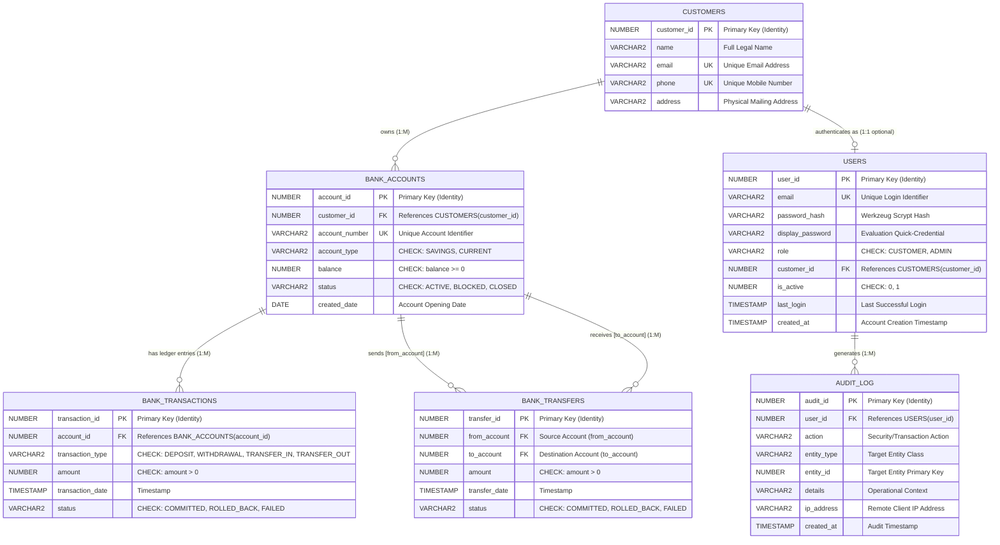

# KAPA Bank — Conceptual & Logical ER Diagrams

This document contains the formal academic **Entity-Relationship (ER) Model** and structural diagrams for the **KAPA Bank Transaction Management System**.

---

## 1. Conceptual ER Diagram (Crow's Foot & Conceptual Hybrid)



---

## 2. Text Version of Conceptual ER Model (For Viva & Manual Drawing)

### Entity 1: `CUSTOMER` (Strong Entity)
- **Conceptual Definition:** Represents the legal individual or business patron holding assets with the bank.
- **Primary Key:** `customer_id`
- **Candidate / Alternate Keys:** `email`, `phone`
- **Attributes:**
  - `customer_id` (Key attribute, Simple, Single-valued, Stored)
  - `name` (Simple, Single-valued, Stored)
  - `email` (Simple, Single-valued, Stored, Unique)
  - `phone` (Simple, Single-valued, Stored, Unique)
  - `address` (Simple, Single-valued, Stored, Nullable)
- **Relationships:**
  - `CUSTOMER` **OWNS** `BANK_ACCOUNT` (1 : M, Total participation on Account side, Partial on Customer side)
  - `CUSTOMER` **AUTHENTICATES AS** `USER` (1 : 1 optional, Partial participation on both sides)

---

### Entity 2: `USER` (Strong Entity)
- **Conceptual Definition:** Represents an authentication principal in the web portal. Decoupled from `CUSTOMER` so that system administrators can exist without holding personal bank customer profiles.
- **Primary Key:** `user_id`
- **Candidate / Alternate Key:** `email`
- **Attributes:**
  - `user_id` (Key attribute, Simple, Single-valued, Stored)
  - `email` (Simple, Single-valued, Stored, Unique)
  - `password_hash` (Simple, Single-valued, Stored)
  - `display_password` (Simple, Single-valued, Stored, Nullable)
  - `role` (Simple, Single-valued, Stored, Domain: 'CUSTOMER' or 'ADMIN')
  - `customer_id` (Foreign Key, Nullable)
  - `is_active` (Simple, Single-valued, Stored, Domain: 0 or 1)
  - `last_login` (Simple, Single-valued, Stored, Nullable)
  - `created_at` (Simple, Single-valued, Stored)
- **Relationships:**
  - `USER` **AUTHENTICATES AS** `CUSTOMER` (1 : 1 optional)
  - `USER` **TRIGGERS** `AUDIT_LOG` (1 : M)

---

### Entity 3: `BANK_ACCOUNT` (Strong Entity)
- **Conceptual Definition:** Represents a specific financial balance container.
- **Primary Key:** `account_id`
- **Candidate / Alternate Key:** `account_number`
- **Foreign Key:** `customer_id` referencing `CUSTOMERS(customer_id)`
- **Attributes:**
  - `account_id` (Key attribute, Simple, Single-valued, Stored)
  - `customer_id` (Foreign Key, Mandatory)
  - `account_number` (Simple, Single-valued, Stored, Unique)
  - `account_type` (Simple, Single-valued, Stored, Domain: 'SAVINGS' or 'CURRENT')
  - `balance` (Simple, Single-valued, Stored, Constraint: balance >= 0)
  - `status` (Simple, Single-valued, Stored, Domain: 'ACTIVE', 'BLOCKED', 'CLOSED')
  - `created_date` (Simple, Single-valued, Stored)
- **Relationships:**
  - `BANK_ACCOUNT` is **OWNED BY** `CUSTOMER` (M : 1, Mandatory participation)
  - `BANK_ACCOUNT` **HAS** `BANK_TRANSACTION` (1 : M, Mandatory on transaction side)
  - `BANK_ACCOUNT` **SENDS** `BANK_TRANSFER` (1 : M, as Source Account)
  - `BANK_ACCOUNT` **RECEIVES** `BANK_TRANSFER` (1 : M, as Destination Account)

---

### Entity 4: `BANK_TRANSACTION` (Subordinate / Ledger Entity)
- **Conceptual Definition:** Single-account chronological double-entry ledger adjustment.
- **Primary Key:** `transaction_id`
- **Foreign Key:** `account_id` referencing `BANK_ACCOUNTS(account_id)`
- **Attributes:**
  - `transaction_id` (Key attribute, Simple, Single-valued, Stored)
  - `account_id` (Foreign Key, Mandatory)
  - `transaction_type` (Simple, Single-valued, Stored, Domain: 'DEPOSIT', 'WITHDRAWAL', 'TRANSFER_IN', 'TRANSFER_OUT')
  - `amount` (Simple, Single-valued, Stored, Constraint: amount > 0)
  - `transaction_date` (Simple, Single-valued, Stored)
  - `status` (Simple, Single-valued, Stored, Domain: 'COMMITTED', 'ROLLED_BACK', 'FAILED')
- **Relationships:**
  - `BANK_TRANSACTION` **BELONGS TO** `BANK_ACCOUNT` (M : 1, Total participation)

---

### Entity 5: `BANK_TRANSFER` (Associative Entity)
- **Conceptual Definition:** Binary relationship entity modeling fund movement between two distinct bank accounts.
- **Primary Key:** `transfer_id`
- **Foreign Keys:**
  - `from_account` referencing `BANK_ACCOUNTS(account_id)` (Source Account)
  - `to_account` referencing `BANK_ACCOUNTS(account_id)` (Destination Account)
- **Attributes:**
  - `transfer_id` (Key attribute, Simple, Single-valued, Stored)
  - `from_account` (Foreign Key, Role: Debited Account)
  - `to_account` (Foreign Key, Role: Credited Account)
  - `amount` (Relationship attribute, Simple, Single-valued, Stored, Constraint: amount > 0)
  - `transfer_date` (Relationship attribute, Simple, Single-valued, Stored)
  - `status` (Relationship attribute, Simple, Single-valued, Stored)
- **Relationships:**
  - Participates in a recursive binary relationship with `BANK_ACCOUNT` via dual roles (`from_account` and `to_account`).

---

### Entity 6: `AUDIT_LOG` (Compliance Entity)
- **Conceptual Definition:** Immutable chronological security trail.
- **Primary Key:** `audit_id`
- **Foreign Key:** `user_id` referencing `USERS(user_id)`
- **Attributes:**
  - `audit_id` (Key attribute, Simple, Single-valued, Stored)
  - `user_id` (Foreign Key, Nullable)
  - `action` (Simple, Single-valued, Stored)
  - `entity_type` (Simple, Single-valued, Stored, Nullable)
  - `entity_id` (Simple, Single-valued, Stored, Nullable)
  - `details` (Simple, Single-valued, Stored, Nullable)
  - `ip_address` (Simple, Single-valued, Stored, Nullable)
  - `created_at` (Simple, Single-valued, Stored)
- **Relationships:**
  - `AUDIT_LOG` is **TRIGGERED BY** `USER` (M : 1, Partial participation)

---

## 3. Relationship Cardinality & Participation Summary Table

| Relationship | Entity 1 | Entity 2 | Cardinality | Entity 1 Participation | Entity 2 Participation | Meaning |
|---|---|---|---|---|---|---|
| **OWNS** | `CUSTOMER` | `BANK_ACCOUNT` | `1 : M` | Partial | Total | One customer owns 0..N accounts; an account must have 1 owner. |
| **AUTHENTICATES** | `CUSTOMER` | `USER` | `1 : 1` | Partial | Partial | An account owner may register for web banking; admins have no customer record. |
| **HAS_LEDGER** | `BANK_ACCOUNT` | `BANK_TRANSACTIONS`| `1 : M` | Partial | Total | An account has 0..N ledger transactions; a transaction belongs to 1 account. |
| **SENDS_TRANSFER** | `BANK_ACCOUNT` | `BANK_TRANSFERS` | `1 : M` | Partial | Total | An account initiates 0..N transfers as the debited source (`from_account`). |
| **RECEIVES_TRANSFER**| `BANK_ACCOUNT` | `BANK_TRANSFERS` | `1 : M` | Partial | Total | An account receives 0..N transfers as the credited target (`to_account`). |
| **TRIGGERS_AUDIT** | `USER` | `AUDIT_LOG` | `1 : M` | Partial | Partial | A user triggers 0..N security audit events during portal operations. |

---

## 4. Special Case: Recursive Inter-Account Transfers

In traditional ER modeling, when an associative entity links two instances of the same entity set, it is modeled with explicit **Role Names**:

```text
                  +--------------------------------+
                  |          BANK_ACCOUNT          |
                  +--------------------------------+
                     |                          |
          (Role: Source Account)      (Role: Destination Account)
          Cardinality: 1              Cardinality: 1
                     |                          |
                     v                          v
                  +--------------------------------+
                  |         BANK_TRANSFERS         |
                  |  - transfer_id (PK)            |
                  |  - amount                      |
                  |  - transfer_date               |
                  |  - status                      |
                  +--------------------------------+
```

- **Invariant:** `from_account <> to_account` enforced via database CHECK constraint.
- **Dual Recording:** One `BANK_TRANSFERS` row corresponds to two atomic `BANK_TRANSACTIONS` rows (`TRANSFER_OUT` on source and `TRANSFER_IN` on destination), satisfying double-entry bookkeeping.
