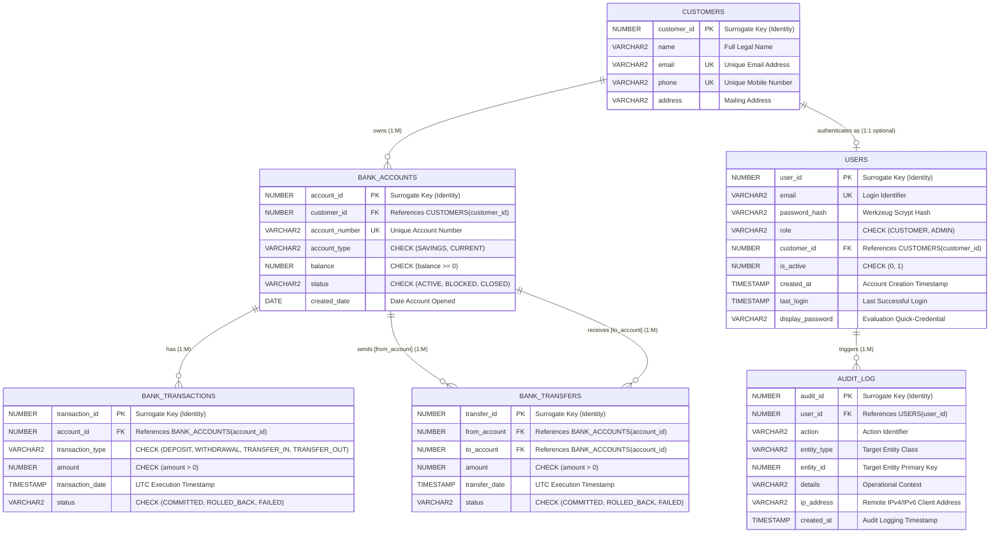

# KAPA Bank — Conceptual & Logical ER Diagrams

This document contains the academic Entity-Relationship (ER) model for the **KAPA Bank Transaction Management System**.

---

## 1. Conceptual ER Diagram (Chen Notation & Crow's Foot Hybrid)

---

## 2. Text Version of Conceptual ER Model

### Entity 1: CUSTOMER (Strong Entity)
- **Primary Key:** `customer_id`
- **Candidate / Alternate Keys:** `email`, `phone`
- **Attributes:**
  - `customer_id` (Key, Single-valued, Stored)
  - `name` (Simple, Single-valued, Stored)
  - `email` (Simple, Single-valued, Stored, Unique)
  - `phone` (Simple, Single-valued, Stored, Unique)
  - `address` (Simple, Single-valued, Stored, Optional)
- **Relationships:**
  - `CUSTOMER` **OWNS** `BANK_ACCOUNT` (1 : M, Total on Account side, Partial on Customer side)
  - `CUSTOMER` **AUTHENTICATES AS** `USER` (1 : 1 optional, 0..1 to 1)

---

### Entity 2: BANK_ACCOUNT (Strong Entity)
- **Primary Key:** `account_id`
- **Candidate / Alternate Key:** `account_number`
- **Foreign Key:** `customer_id` &rarr; `CUSTOMERS.customer_id`
- **Attributes:**
  - `account_id` (Key, Single-valued, Stored)
  - `customer_id` (Foreign Key, Single-valued, Stored)
  - `account_number` (Simple, Single-valued, Stored, Unique)
  - `account_type` (Simple, Single-valued, Stored, Domain: `{'SAVINGS', 'CURRENT'}`)
  - `balance` (Simple, Single-valued, Stored, Domain: `balance >= 0`)
  - `status` (Simple, Single-valued, Stored, Domain: `{'ACTIVE', 'BLOCKED', 'CLOSED'}`)
  - `created_date` (Simple, Single-valued, Stored)
- **Relationships:**
  - `BANK_ACCOUNT` **OWNED BY** `CUSTOMER` (M : 1)
  - `BANK_ACCOUNT` **HAS** `BANK_TRANSACTION` (1 : M, Total on Transaction side)
  - `BANK_ACCOUNT` **SENDS** `BANK_TRANSFER` as `from_account` (1 : M)
  - `BANK_ACCOUNT` **RECEIVES** `BANK_TRANSFER` as `to_account` (1 : M)

---

### Entity 3: BANK_TRANSACTION (Weak / Associative History Entity)
- **Primary Key:** `transaction_id`
- **Foreign Key:** `account_id` &rarr; `BANK_ACCOUNTS.account_id`
- **Attributes:**
  - `transaction_id` (Key, Single-valued, Stored)
  - `account_id` (Foreign Key, Single-valued, Stored)
  - `transaction_type` (Simple, Domain: `{'DEPOSIT', 'WITHDRAWAL', 'TRANSFER_IN', 'TRANSFER_OUT'}`)
  - `amount` (Simple, Domain: `amount > 0`)
  - `transaction_date` (Simple, Stored Timestamp)
  - `status` (Simple, Domain: `{'COMMITTED', 'ROLLED_BACK', 'FAILED'}`)

---

### Entity 4: BANK_TRANSFER (Associative / Relationship Entity)
- **Primary Key:** `transfer_id`
- **Foreign Keys:**
  - `from_account` &rarr; `BANK_ACCOUNTS.account_id` (Sender Role)
  - `to_account` &rarr; `BANK_ACCOUNTS.account_id` (Receiver Role)
- **Attributes:**
  - `transfer_id` (Key, Single-valued, Stored)
  - `from_account` (Foreign Key, Source Account)
  - `to_account` (Foreign Key, Destination Account)
  - `amount` (Simple, Domain: `amount > 0`)
  - `transfer_date` (Simple, Stored Timestamp)
  - `status` (Simple, Domain: `{'COMMITTED', 'ROLLED_BACK', 'FAILED'}`)
- **Integrity Constraint:** `from_account <> to_account` (Prevent self-transfer)

---

### Entity 5: USER (Authentication Entity)
- **Primary Key:** `user_id`
- **Candidate / Alternate Key:** `email`
- **Foreign Key:** `customer_id` &rarr; `CUSTOMERS.customer_id` (Nullable for system administrators)
- **Attributes:**
  - `user_id` (Key, Single-valued, Stored)
  - `email` (Simple, Single-valued, Stored, Unique)
  - `password_hash` (Simple, Single-valued, One-way Cryptographic Hash)
  - `role` (Simple, Domain: `{'CUSTOMER', 'ADMIN'}`)
  - `customer_id` (Foreign Key, Nullable for Admin)
  - `is_active` (Simple, Domain: `{0, 1}`)
  - `last_login` (Simple, Nullable Timestamp)
  - `created_at` (Simple, Timestamp)
  - `display_password` (Simple, Academic Evaluation Aid)

---

### Entity 6: AUDIT_LOG (Observability & Governance Entity)
- **Primary Key:** `audit_id`
- **Foreign Key:** `user_id` &rarr; `USERS.user_id` (Nullable on user delete)
- **Attributes:**
  - `audit_id` (Key, Single-valued, Stored)
  - `user_id` (Foreign Key, Optional)
  - `action` (Simple, Action Code e.g. `LOGIN_SUCCESS`, `TRANSFER`)
  - `entity_type` (Simple, Target Entity Class e.g. `ACCOUNT`, `CUSTOMER`)
  - `entity_id` (Simple, Numeric ID of Target Entity)
  - `details` (Simple, Descriptive Audit Narrative)
  - `ip_address` (Simple, Client IPv4/IPv6 Address)
  - `created_at` (Simple, Timestamp)
